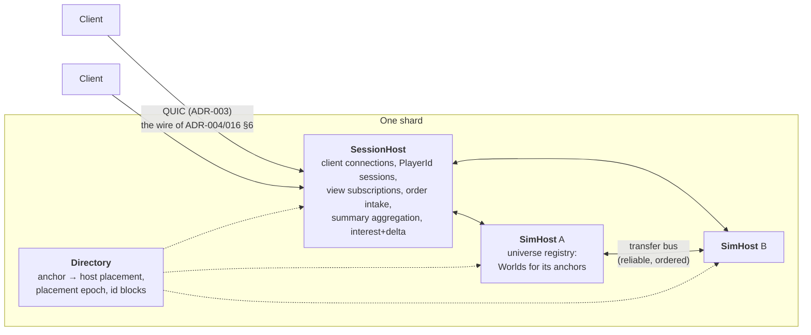

# ADR-019 — Shard Topology: Three Roles, Anchor Placement, Cross-Host Transfers

**Status:** Accepted · 2026-08-19 (design deliverable [ADR-018](ADR-018-scaling-baseline.md)
A1 — **blocks U2**)
**Depends on:** ADR-002 (tick), ADR-003 (transport), ADR-004 (wire), ADR-005
(determinism), ADR-007 (threads, single-writer, transport-only crossings), ADR-008
(hosting), ADR-014 (engine/game seam), ADR-016 (universe runtime, transfer bus, anchors),
ADR-017 (rosters), ADR-018 (**D1** the shard target, **D1a** location transparency,
**D2** persistence, **D5** `PlayerId`, **D6a** id allocation, **D8** worlds forget,
**D17** transfer order)
**Amends:** ADR-016 §4 (the registry becomes host-aware and the world's tick becomes
shard-global — §2, §6); ADR-018 D6a (the ship→location index is refined into the session
role's projection — §5c); ADR-008 §8 (the packaging split acquires a third axis — §1)
**Feeds:** U2 (the constraints in §6 are its acceptance), the interest/delta ADR
(ADR-018 D4 — §5d hands it a changed problem; **delivered as
[ADR-022](ADR-022-interest-and-delta.md)**, which takes §5d as its §1), the persistence ADR (§8)

## Context

ADR-018 D1 set the target: **one persistent shard, hundreds of concurrent commanders, one
universe**. ADR-016 built the runtime that has to carry it — a registry of `World`s keyed
by anchor, a transfer bus applying between ticks — and D1a already committed the shape:
worlds share no mutable state during `Tick`, all crossings are serialised records. What no
document decided is **what happens when "the registry" stops being one process**: which
machine owns which grid, who orders transfers when two hosts file them, and what a client's
connection does when its view moves to a grid on another machine.

The U-phase implementation is **single-process and stays that way**. This ADR is not a
build order for a server farm; it is the set of shapes U2 must not foreclose. That
distinction is the whole point of writing it now: ADR-018 D1b blocks U2 on this document
precisely because the registry's API — not its implementation — is what a later split
either inherits or fights.

**Sizing, so the design is not aimed at an imaginary problem.** At ADR-018 D15.6's envelope
(~200 owned ships, ~12 concurrent fleets per commander) and 300 commanders: ~60,000 ships
in ~3,600 fleets, clustering at hubs into perhaps 1,000–2,500 live grids. **The tick cost is
measured rather than guessed, by CI rather than by hand** (ADR-018 A4 — the in-repo soak runs
in the shipping binary on every push, and these are the **authoritative MSVC Release** figures
D11 asked for), against the converging-crowd pattern that is the worst case for both the
avoidance scan and `Separate`:

| ships on one grid | mean tick | worst tick | of the 50 ms budget | grids per core at 20 Hz |
|---|---|---|---|---|
| 41 (the MVP fleet) | 0.016 ms | 0.028 ms | 0.03 % | ~3,100 |
| 256 | 0.568 ms | 1.052 ms | 1.1 % | ~88 |
| 512 | 2.164 ms | 2.758 ms | 4.3 % | ~23 |
| 1,024 (the D4 cap) | 7.728 ms | 13.605 ms | 15 % | ~6.5 |

*(The first table here carried an indicative clang cross-build — 10.6 ms at the cap. MSVC
Release is faster, so every conclusion below held with more room than it was granted. Debug is
78.3 ms, 10.1× Release and 156 % of the tick, which is D11's whole argument in one row.)*

The shape is the expected quadratic, and the headline is that **a grid at the cap costs about
a seventh of a core, not a whole one** — so the honest answer at the stated target is *a
handful of hosts*, and possibly one for the sim at realistic occupancy. That is the point:
this design exists so the host count **can** be greater than one, not because it must be
large. Everything below is chosen for cheapness at N=1 and correctness at N>1.

## Decision

### 1. Three roles, one process today

The shard is described as three **roles**, not three programs. Today all three live inside
`Outpost.exe` (and inside `ServerHost` where they are engine concerns); a split promotes a
role to a process without changing any contract.

| Role | Owns | Never |
|---|---|---|
| **SimHost** | The `World`s for the anchors placed on it; their tick; per-grid state emission; its half of the transfer bus | Knows a client, a `PlayerId`'s whole fleet list, or another host's world state |
| **SessionHost** | Client connections and `PlayerId` sessions (ADR-018 D5), view subscriptions, the order stream, per-player summary aggregation, per-client interest/delta and datagram packing | Simulates anything; holds authoritative world state |
| **Directory** | Placement (anchor → `HostId`), the placement epoch, host membership, ship-id blocks | Sits in any per-tick path |

**Why the roles split here.** The seam between SimHost and SessionHost is the one place the
existing architecture already cuts: a per-grid snapshot is produced by whoever owns the grid
and consumed per-client by whoever owns the client. Everything that is *per player* — which
grid they watch, which of their fleets are where, what fits in their datagram — is
naturally the session role's, and **a player's fleets can span hosts**, so nothing else
could aggregate them. ADR-008's packaging claim gains a third axis: client/server was the
first, sim/session is the second, and both are packaging rather than redesign because
neither shares memory.

**ADR-014 holds unchanged.** These are engine roles hosting *a* simulation. Transfer
records and per-grid state are **game payloads the engine relays as opaque bytes**, exactly
as it already relays snapshots and order submissions; the universe registry that gives them
meaning stays GameLogic's, reached through the composition root. A `SimHost` that parsed a
transfer record would be an engine reading game semantics — the same line ADR-004 ruling 4
and ADR-014 §2b already draw.

### 2. The shard tick is global

**`tick` is a shard-wide number, not a per-world counter.** Every host runs ADR-002's fixed
20 Hz absolute schedule against a common epoch, so tick *N* names the same 50 ms everywhere.
Hosts are **not** in lockstep — host A may be executing tick 1,004 while host B is on 1,002
— but they agree on what those numbers mean, and the skew is bounded and monitored
(`hostTickSkew`, a release counter alongside `tickOverrun`).

**The mechanism for this already exists**, which is worth noticing before U2 reinvents it:
`World::Tick(_tick)` takes the tick **as a parameter** (`World.h:263`, `World.cpp:347`)
rather than incrementing a private counter, so a registry that drives every world with one
number gets shard time for free. What is missing is the *contract* saying it must. Nothing
states that the number is shard-global rather than per-world; `Reset` zeroes `m_tick`
(`World.cpp:222`) and the hash folds it (`WorldHash.cpp:47`), so a freshly recreated world
reports tick 0 until its first `Tick`, and a recreate-versus-original hash comparison is only
meaningful at **equal shard ticks**. U2 therefore states the contract — the registry drives
every world with the shard tick, and a world spun up at shard tick *N* begins there — and its
teardown/recreate test compares at equal ticks rather than at equal ages. `Tick()` is shard
time everywhere it is read, including in `legStartTick`, `legDeadlineTick` and
`protectedUntilTick`.

Two consequences worth stating. The client's `t_est` is a **shard** clock, so a view switch
across hosts does not reset it — the ~200 ms settle of ADR-016 §7 stays a buffer refill and
never becomes a re-sync. And ADR-002's `uint32` epoch (~6.8 years at 20 Hz) is now a
*shard-lifetime* quantity rather than a session one; ADR-018 D2 already records it as the
persistence design's problem, and this is the sentence that makes it concrete.

### 3. Placement: the anchor is the unit, the directory is the truth

**One anchor's `World` lives entirely on one host.** A grid never spans hosts — which makes
ADR-018 D4's per-grid cap (1,024 entities) a *per-core* constraint as well as a wire one: a
capped grid must fit one core's 50 ms budget, because nothing can split it. The Context's
measurement is what says that constraint is currently satisfied with roughly 5× headroom, and
it is the number to re-take if the tick ever grows a system.

- **Truth:** `HostForAnchor(AnchorId) -> HostId`, served by the directory and cached by
  every role, stamped with a **`PlacementEpoch`**. A message that crosses hosts carries the
  epoch it was addressed under; a receiver holding a newer epoch refuses and redirects
  rather than guessing.
- **Heuristic:** placement prefers **region affinity** — a region's anchors land on the same
  host where load allows. Most gate hops are intra-region (ADR-016 §1's ~50 systems per
  region), so the common traversal stays a local transfer and never touches the network.
  This is a heuristic, not a rule: the correctness of §4 does not depend on it.
- **Assignment happens at spin-up, and only at spin-up.** A live grid is never migrated.

**Why no live migration, and why that is not a fudge.** ADR-018 D8 made worlds forgetful:
everything durable is a universe-layer record, and a torn-down world is recreatable
bit-exactly from (session seed, anchor id) plus those records. So the mechanism for moving a
grid already exists — *let it empty and spin it up elsewhere* — and grids empty constantly,
because that is the teardown rule. **Named so it is not mistaken for covered:** a permanently
busy hub never empties, so a hot grid cannot be rebalanced away from an overloaded host in
v1. The escape hatch is not a new mechanism but the same one under coordination (quiesce the
grid, checkpoint, recreate on the target, replay buffered transfers) — reserved, unbuilt,
and cheap precisely because D8 was decided the way it was.

### 4. The transfer bus across hosts

ADR-018 D17 fixed the order — `(applyTick, transferId)`. Two additions make it work with
more than one filer, and both are free at N=1.

**4a. `TransferId` is `(HostId, hostLocalCounter)`.** A host mints its own ids with no
coordination, and the composite is **totally ordered without a tie-break conference**:
sort by `applyTick`, then `HostId`, then counter. This is what makes the order a property of
the records rather than of the arrival sequence — the destination applies the same set in
the same order no matter which link delivered what first, which is the whole determinism
claim. Today `HostId = 0` and the shape is a two-field struct nobody notices.

**4b. A transfer is filed at departure, not at arrival.** The record travels the instant the
ships leave, carrying an `applyTick` seconds in the future (ADR-016 §5's spool + transit).
The destination host buffers it and applies it when its clock reaches `applyTick`. This
turns cross-host latency into slack instead of a race: the network has the whole transit
duration to deliver a record whose delivery it will not be asked about until then.

That slack must be guaranteed rather than assumed, so it becomes a constraint on the timing
tables: **no transfer may carry a transit shorter than `TRANSFER_FLOOR_TICKS`** (proposed:
20 ticks = 1 s), which bounds worst-case host skew plus inter-host RTT with room to spare.
ADR-016 §5's gate jump — "a fixed short duration" — is the one that could have been tuned
under this floor without noticing; it now has a floor to respect.

**4c. Failure to deliver is a fault, and faults do not corrupt.** If `applyTick` arrives and
a promised record has not, the destination **stalls that world** rather than ticking past a
transfer it will later have to insert into history (a bounded stall, counted; the alternative
— apply late and record the real tick — makes world state a function of network timing, which
is exactly what ADR-005's replay contract exists to forbid). A stall past its bound escalates
to §7's host-failure path. The bus rides ADR-003's reliable ordered channel between host
pairs, so ordinary loss is the transport's problem and never reaches this rule.

**4d. The replay contract, restated for the shard.** A session replay is the per-grid order
logs **plus the transfer log**, and the transfer log is now a per-host stream merged by
`(applyTick, transferId)` — a deterministic merge, because the key is total. In-flight
transit records and the bus queue fold into the registry-level hash (ADR-018 D17), so a
divergence in a minutes-long transit is visible when it happens rather than on arrival.

### 5. The SessionHost: one client connection, whatever the topology

**5a. The client connects once, to the shard.** It never learns a `HostId`, never reconnects
on a view switch, and never holds more than one connection. The session host subscribes to
grid streams on the player's behalf and relays.

**This changes nothing on the wire.** ADR-016 §6's view request, grid-switch notice and
per-grid snapshot header were designed for a client that watches one grid at a time and is
told when that changes — which is exactly the behaviour a cross-host switch produces. A
result worth stating plainly: **the client protocol is already topology-agnostic**, so the
shard is a server-side concern end to end.

**5b. Sessions outlive connections** (ADR-018 D5). The session host holds the `PlayerId`
session — subscriptions, order sequence high-water, the grace window — across a transport
drop, which is also what the reconnect print requires and what makes a session host's own
restart survivable by clients.

**5c. The ship→location index is the session role's projection.** ADR-018 D6a placed it with
the registry; this refines it, because under a shard no single registry sees every world. The
index is a **projection of the transfer log**: a ship's location changes only by transfer, so
replaying transfers reconstructs it exactly. Registries keep authoritative occupancy for
*their own* grids; the session role keeps the player-scoped answer ("where are my fleets")
that roster blocks, summaries and view rights all ask. **Id allocation stays registry-owned**
— D6a's actual load-bearing claim, and untouched: authored occupants derive ids from their
anchor, and dynamic ids come from a **host-held block** issued by the directory. Determinism
survives block allocation for free, because D6a already made `World::Spawn` take an *injected*
id: the id is an input recorded in the log, never a value the world derives.

**5d. Interest and delta belong to the session role, and the datagram cap is a client-link
property.** This is the topological result that most changes ADR-018 D4's problem, so it is
recorded here rather than discovered there: a SimHost emits its grid's state to session hosts
over an **internal link with no 1,152-byte constraint** (that number is ADR-003's *client*
datagram cap, not a law of the building), and the session host — which alone knows the
client's view, selection and link — performs interest culling, delta encoding against that
client's acked baseline, and datagram packing. The interest/delta ADR therefore designs one
mechanism in one place that already has every input it needs, instead of splitting relevance
across a tier that cannot see the client.

### 6. What U2 must build — the constraints that bite now

These are U2's acceptance items; the implementation stays single-process with `HostId = 0`.

1. **Worlds are addressed by `AnchorId`, never by a pointer held across a tick.** The
   registry hands out short-lived borrows; nothing outside it stores a `World*`.
2. **Filing a transfer names a destination `AnchorId` and never touches the destination
   world.** No code path may look up a destination registry entry and mutate it — the record
   is the only crossing, whether the destination is a pointer away or a machine away.
3. **`TransferId` is `(HostId, counter)` from the first line**, with the total order
   `(applyTick, hostId, counter)` implemented as written in §4a.
4. **`HostForAnchor(AnchorId)` exists and returns 0.** Every cross-world addressing path goes
   through it, so the day it returns something else, the call sites already exist.
5. **The shard tick is the registry's, stated as a contract** (§2): every world is driven with
   the same number, a world spun up at shard tick *N* begins there, and the teardown/recreate
   test compares hashes at equal shard ticks. The `Tick(_tick)` parameter already affords this;
   what U2 adds is the rule and the test.
6. **Player-scoped queries never walk the registry** — they go through the index of §5c, so
   no code assumes one process can enumerate every world.
7. **Ship ids come from a host-held block**, and `World::Spawn` takes the id (ADR-018 D6a).
8. **A live grid is never migrated** (§3), and the teardown/recreate path is the only way a
   grid changes host.

Each is a shape, not a mechanism: the cost at N=1 is a type, a function returning a constant,
and a discipline the CI-guarded isolation test (ADR-018 A8) already polices.

### 7. Failure and recovery

- **A SimHost is lost.** Its grids are gone; surviving hosts recreate them from authored
  content plus universe-layer durable records — which is D8's forgetfulness paying its
  second dividend, since recreation is a path the registry test already exercises. Ships
  that were *on* those grids are lost with them until §8's checkpointing exists; ships
  **in transit to** them are not, because their records live at the source until `applyTick`.
- **A SessionHost is lost.** Clients reconnect through the front door; the D5 grace window
  and the index's reconstructibility (§5c) mean nothing authoritative was on it.
- **The Directory is lost.** Placement is cached everywhere, so a shard runs on its last
  known epoch and refuses only *new* spin-ups. Directory high-availability is named and
  deferred; it is the one role whose loss is degraded-but-alive by design.
- **What is deliberately not solved:** split-brain (two hosts believing they own one anchor)
  is prevented by the directory being the single writer of placement, and its failure mode is
  refusal rather than duplication. A partitioned network can stall worlds (§4c); it cannot
  fork one.

### 8. Persistence (the seam, not the design)

ADR-018 D2 committed to a long-lived service without a save design. This ADR fixes only where
it will attach: **durable state is per-anchor universe-layer records** (rosters today; sites,
wrecks and structures later), so persistence is **sharded by the same key as placement** and a
checkpoint is a per-anchor artifact a single host can write alone. The persistence ADR owns
cadence, format, the tick-epoch question (§2), and what a checkpoint means for ships in
transit. Nothing in §§1–7 assumes it exists.

### 9. What this deliberately does not do

- **No cross-host world.** A grid is one host's, always. The cap in ADR-018 D4 is what makes
  that safe, and §3 is what makes it a stated constraint rather than a hope.
- **No live grid migration** (§3), no dynamic rebalancing of hot grids.
- **No lockstep between hosts.** They share a tick *numbering*, not a barrier — §4b's slack
  is what buys that, and it is why a slow host degrades locally instead of globally.
- **No directory HA, no persistence, no host auto-scaling.** Named, deferred, and each has
  the seam it will attach to.
- **No client-visible change of any kind** (§5a). If a future decision requires one, it has
  left this ADR's ground.

## Alternatives rejected

- **Clients connect directly to grid hosts.** Removes the relay hop, and costs a reconnect on
  every view switch — the ~200 ms settle of ADR-016 §7 becomes a full QUIC handshake plus
  handshake-time validation, several times worse and visible. It also leaves fleet summaries
  unaggregatable (a player's fleets span hosts, so *someone* must join them) and puts interest
  and delta on the tier that cannot see the client (§5d). Rejected on all three counts.
- **A single global authority minting `TransferId`s.** Simpler to reason about, and a
  coordination round-trip on the one path that must never be slow. §4a gets a total order for
  free instead. Rejected.
- **Applying transfers on arrival rather than at `applyTick`.** Removes the stall of §4c and
  makes world state a function of packet timing — the exact property ADR-005 §5 forbids and
  the replay suite exists to catch. Rejected without regret.
- **Sharding by region rather than by anchor.** Coarser and better for locality, but it makes
  a busy region indivisible and hands the same hot-spot problem a bigger unit. Region affinity
  is kept as the *placement heuristic* (§3) where it earns its keep, and the anchor stays the
  unit. Rejected as a unit, adopted as a bias.
- **One process per system, or per grid.** Thousands of processes to schedule, and per-grid
  overhead dwarfing per-grid work at the 30-ship median. Rejected.
- **Instance-per-session (the co-op reading).** Deletes this entire document, and was
  considered and declined at ADR-018 D1. Recorded here so the alternative is visible from the
  topology side too.
- **Lockstep tick barriers across hosts.** Would make the whole shard as slow as its slowest
  host and turn every network hiccup into a global stall. §4b's departure-time filing gets
  determinism without it. Rejected.

## Consequences

- **U2's acceptance grows §6's eight items**, and the Universe Build Order records them; none
  is more than a shape at `HostId = 0`.
- **ADR-016 §4 is amended twice**: the registry becomes host-aware (`HostForAnchor`), and the
  shard tick becomes a stated contract rather than a convention — worth landing whether or not
  a second host ever exists, because `applyTick` means nothing without it and the world hash
  folds the number.
- **The interest/delta ADR (ADR-018 D4/A14) inherits a changed problem** — §5d gives it one
  home with every input, and frees it from the 1,152-byte cap on the internal tier.
- **ADR-016 §5's timing tables gain a floor** (`TRANSFER_FLOOR_TICKS`), which U3a and U4 must
  respect when they set spool, transit and jump durations.
- **New release counters:** `hostTickSkew`, `transferStallTicks`, `placementEpochRefusals` —
  on ADR-007 §8's existing telemetry rails, per R10's regime.
- **Risk R21's mitigation is now this document**, and its early validation is U2's isolation
  and permuted-order tests (ADR-018 A8) rather than a future spike.
- **No code is written by this ADR.** It constrains U2 and nothing before it.
