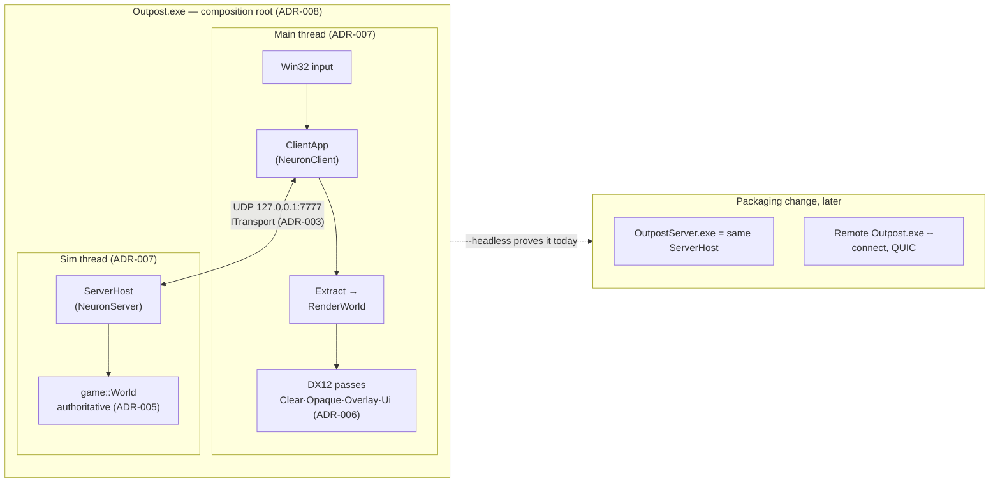

# Outpost: Frontier — Architecture Overview (MVP)

**Status:** Session output 2026-08-17 · governed by [ADR-001…008](ADR/)

One Windows x64 executable hosts an authoritative game server and a DX12 client that talk
exclusively over a UDP loopback socket behind a QUIC-shaped transport. The simulation is a 2D
plane rendered as flat-shaded 3D under a 30° orthographic camera. Splitting server from client
later is a packaging change because there is no other channel between them to unwind.

## Process model



Both halves link **GameLogic**: the server as the authority; the client for the shared order
validation, formation solve, and wire schemas (the parity the HUD's ghost/bounce design
requires). Neither half ever touches the other's world — single-writer ownership, enforced by
debug asserts (ADR-007).

## The one data flow

Input → order → server tick → snapshot → render. Everything the MVP does is one lap of this
loop; every future feature (combat, economy, prediction) widens a station on it rather than
adding a second loop.

```mermaid
sequenceDiagram
    participant P as Player (mouse)
    participant C as ClientApp (Main thread)
    participant G as GameLogic (linked both sides)
    participant S as ServerHost (Sim thread, 20 Hz)

    P->>C: click-drag: plane point + facing
    C->>G: SolveFormation (footprint preview)<br/>ValidateOrder (pre-check, quantised view)
    alt pre-check fails
        C-->>P: bounce + reason toast (150 ms) — no send
    else
        C->>S: OrderSubmit{seq, ships, formation, leg} (reliable stream)
        C-->>P: ghost renders PENDING (dashed)
        S->>G: ValidateOrder (authoritative, same code)
        alt rejected
            S->>C: OrderAck{seq, reason} → same bounce, one round trip later
        else accepted
            S->>G: create OrderGroup, solve stations
            Note over S: next tick: Ingest → GroupAdvance →<br/>Steering → Integrate → Emit
            S->>C: Snapshot{tick, ships, orderStates} (datagram, every 50 ms)
            C->>C: buffer ≥2 snapshots, render at t−100 ms<br/>interpolate (extrapolate ≤250 ms → STALE)
            C-->>P: ghost promotes to underway; HUD shows ETA per leg
        end
    end
```

Latency budget on loopback: ≤ 50 ms order pickup + 100 ms interpolation delay, fully masked by
the instant client-side ghost. The same numbers hold over a real link plus RTT — nothing about
the MVP flow assumes locality.

## Time

| Clock | Owner | Definition |
|---|---|---|
| `tick : u32` | Server | Simulation time. 20 Hz fixed (50 ms). The only time GameLogic knows. |
| `t_est` | Client | Estimated server time, slew-corrected from snapshot arrivals (drift shown in debug HUD). |
| `t_render` | Client | `t_est − 2 ticks`; interpolation target. |
| Wall clock | Neither sim | Logging/telemetry only. GameLogic reading a clock is a determinism bug (ADR-005). |

## Space

Two levels, one plane (ADR-001 + ADR-009). The **universe** is addressed in exact `int64`
metres (`UniversePos`) — systems, planets, stations, gates, and grid anchors are all persistent
integer placements, giving ±975 ly of headroom that content can grow into without a coordinate
migration. The **tactical grid** is local float32 metres (≈40 km, mm precision) anchored at a
`UniversePos`; the sim, the wire (cm-quantised), and the renderer only ever see local space.
Absolute position is `anchor + local`, exactly reconstructible. Inter-system travel is a graph
of gates, not flown space, so distances between systems are map layout, not navigation input.

MVP content is one authored system (Vesta-3: star, two planets, one station) loaded from
`GameData/Universe/` by both halves and guarded by a `universeHash` in the handshake — the MVP
boots from the universe definition rather than a hardcoded scene.

## Library responsibilities (summary — see [Dependency-Map.md](Dependency-Map.md))

| Project | One-line charter |
|---|---|
| **NeuronCore** | Engine primitives, zero game semantics: math, time, logging, telemetry lanes, ByteReader/Writer, PCG32, task pool, `ITransport` + UDP/QUIC implementations, framing wire messages. |
| **GameLogic** | The deterministic planar sim: world tables, ship classes, orders/groups, formation solve, validation + reason codes, game wire schemas, snapshot emit/apply, universe definition + parsing. |
| **NeuronServer** | `ServerHost`: session table, tick-loop orchestration, connection handling, snapshot fan-out. |
| **NeuronClient** | `ClientApp`: window/device, frame loop, snapshot buffering + interpolation, Extract, passes, camera, picking, HUD, order pre-check UX. |
| **Outpost.exe** | Composition root: args → configs → `ServerHost.Start()` → `ClientApp.Run()` → ordered shutdown. |
| **Tests/**\* | VS CppUnitTestFramework per-library suites; replay determinism and wire round-trips live in `GameLogicTests`. |

## Frame and tick anatomy

**Sim thread, every 50 ms** (waitable timer, absolute schedule, snap-forward past 250 ms debt):
`Poll transport → Ingest validated orders → GroupAdvance → Steering → Integrate → EmitSnapshot
→ Send (≤1,152 B datagram/client)`. Budget: the tick must fit 50 ms with 1,024 entities; at
MVP scale it is microseconds. `tick_overrun` is a release counter.

**Main thread, every frame** (vsync or free):
`Pump Win32 → Poll transport → Buffer snapshots → Extract (interpolate → InstanceRecords +
overlay lists + HUD state) → Record (4 PSOs, one direct queue) → Present (flip, 2 in flight)`.
The `GAME/EXTRACT/RENDER/UI` stage timings are measured from the first slice — they are the
corpus debug HUD's budget rows.

## Deliberate MVP omissions and their reserved seams

| Omitted | Reserved seam (already in the design) |
|---|---|
| Combat, abilities, stances | Order kinds beyond `Move`; ability rack renders disabled. |
| Delta compression, interest mgmt | `Snapshot.baselineTick` field; per-client emit path (ADR-004). |
| Client prediction | Client links GameLogic; snapshots carry tick + order acks (ADR-002). |
| msquic in the first slices | `ITransport` is QUIC-shaped; spike slice S13 (ADR-003). |
| HDR, bloom, nebula, GPU cull | Reserved pass slots in the fixed pass list (ADR-006). |
| Multi-client, matchmaking | ServerHost session *table* (not a singleton session); `--connect`. |
| Persistence, accounts | Session-surfaces flow is post-MVP; schema-hash handshake already speaks `UpdateRequired`. |
| Gates, docking, multi-system | Universe definition already models systems/gates/stations; MVP authors one system and anchors one grid (ADR-009 §9). |
| Audio | NeuronClient charter slot; nothing depends on its absence. |

## Alignment with the screen-print corpus

The prints under `Design/ScreenPrints/` are design sheets with decisions embedded. The MVP
honours, and must not contradict: planar movement as the cheap primitive (`puck-and-wheel`),
ghost→promotion→bounce order feedback with client/server verdict parity (*BounceParity*),
4-leg order queues, the 1,024-entity replication cap and 250 ms extrapolation cap
(`tactical-icon-system`), plane-lying 2:1 selection ellipses (⇒ 30° camera), the
Overlay-pass position and two-mechanism split (`overlay-pass`), thread-lane budgets and the
`GAME/EXTRACT/RENDER/UI` stage taxonomy (`debug-hud`), and fail-closed schema-hash session
entry (`session-surfaces`). Where a print describes post-MVP systems (strategic map, alerts
taxonomy, settings surface), the MVP only keeps their load-bearing invariants cheap to adopt
later — it does not build them.
