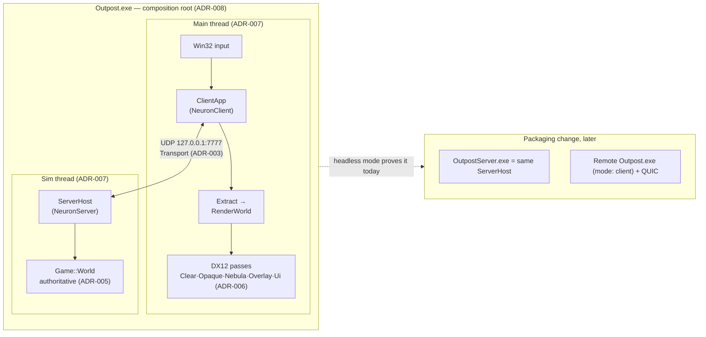

# Outpost: Frontier — Architecture Overview (MVP)

**Status:** Session output 2026-08-17 · **revised 2026-08-18 after S5–S6** · governed by
[ADR-001…014](ADR/)

One Windows x64 executable hosts an authoritative game server and a DX12 client that talk
exclusively over a UDP loopback socket behind a QUIC-shaped transport. The simulation is a 2D
plane rendered as flat-shaded 3D under a 30° orthographic camera. Splitting server from client
later is a packaging change because there is no other channel between them to unwind.

## Process model



**Only `Outpost.exe` links GameLogic** (ADR-014), and **CI fails the build if that stops being
true.** `Neuron*` is a shared engine — the sibling repository runs a different game on it — so
the server hosts *a* `Simulation` and the client renders *a* `WorldView`, both engine-declared
interfaces injected by the composition root.

*Who implements them was the one thing ADR-014 got wrong.* It said GameLogic does, and also
that GameLogic depends on NeuronCore only; those cannot both hold, because the interfaces are
declared in NeuronServer and NeuronClient. S5c settled it (ADR-014 §2a): **the composition root
holds the vtable** and forwards to GameLogic's pure functions. GameLogic keeps its freedom from
Windows, D3D12 and file IO — which is what lets `GameLogicTests` run with no device and no
fixtures — and the adapter lives in the one project always allowed to know both halves.

The client still runs the game's own validation and formation solve (the parity the HUD's
ghost/bounce design requires); it reaches them through the seam rather than through a link.
Neither half ever touches the other's world — single-writer ownership, enforced by debug
asserts (ADR-007).

## The one data flow

Input → order → server tick → snapshot → render. Everything the MVP does is one lap of this
loop; every future feature (combat, economy, prediction) widens a station on it rather than
adding a second loop.

```mermaid
sequenceDiagram
    participant P as Player (mouse)
    participant C as ClientApp (Main thread)
    participant G as GameLogic (through the seam, ADR-014 §2a)
    participant S as ServerHost (Sim thread, 20 Hz)

    P->>C: click-drag: plane point + facing
    C->>G: SolveFormation (footprint preview)<br/>ValidateOrder (pre-check, quantised view)
    alt pre-check fails
        C-->>P: bounce + reason toast (150 ms) — no send
    else
        C->>S: OrderSubmit{seq, ships, formation, leg} (reliable stream)
        C-->>P: ghost renders PENDING (dashed)
        S->>G: ValidateOrder (authoritative, same code)
        alt rejected
            S->>C: OrderAck{seq, reason} → same bounce, one round trip later
        else accepted
            S->>G: create OrderGroup, solve stations
            Note over S: next tick: Ingest → GroupAdvance →<br/>Steering → Integrate → Emit
            S->>C: Snapshot{tick, ships, orderStates} (datagram, every 50 ms)
            C->>C: buffer ≥2 snapshots, render at t−100 ms<br/>interpolate (extrapolate ≤250 ms → STALE)
            C-->>P: ghost promotes to underway; HUD shows ETA per leg
        end
    end
```

Latency budget on loopback: ≤ 50 ms order pickup + 100 ms interpolation delay, fully masked by
the instant client-side ghost. The same numbers hold over a real link plus RTT — nothing about
the MVP flow assumes locality.

## Time

| Clock | Owner | Definition |
|---|---|---|
| `tick : u32` | Server | Simulation time. 20 Hz fixed (50 ms). The only time GameLogic knows. |
| `t_est` | Client | Estimated server time, slew-corrected from snapshot arrivals (drift shown in debug HUD). |
| `t_render` | Client | `t_est − 2 ticks`; interpolation target. |
| Wall clock | Neither sim | Logging/telemetry only. GameLogic reading a clock is a determinism bug (ADR-005). |

## Space

Two levels, one plane (ADR-001 + ADR-009). The **universe** is addressed in exact `int64`
metres (`UniversePos`) — systems, planets, stations, gates, and grid anchors are all persistent
integer placements, giving ±975 ly of headroom that content can grow into without a coordinate
migration. The **tactical grid** is local float32 metres (≈40 km, mm precision) anchored at a
`UniversePos`; the sim, the wire (cm-quantised), and the renderer only ever see local space.
Absolute position is `anchor + local`, exactly reconstructible. Inter-system travel is a graph
of gates, not flown space, so distances between systems are map layout, not navigation input.

MVP content is one authored system (Vesta-3: star, two planets, one station) loaded from
`GameData/Universe/` by both halves and guarded by a `universeHash` in the handshake — the MVP
boots from the universe definition rather than a hardcoded scene.

**Celestials are data, not geometry** (ADR-009 §9a, owner decision). Nothing in the corpus
draws a celestial body: the tactical print is empty space with an ambient haze, and the
strategic map is a node graph that reports stations and gates as panel text. They give a system
its identity, its layout and the coordinates the strategic map will place a node from; drawing
them is not owed, and no slice does it.

## Library responsibilities (summary — see [Dependency-Map.md](Dependency-Map.md))

| Project | One-line charter |
|---|---|
| **NeuronCore** | Engine primitives, zero game semantics: time, logging, telemetry lanes, ByteReader/Writer, **JSON parser/writer**, PCG32, task pool, `Transport` + UDP/QUIC implementations, framing wire messages. No math layer — DirectXMath is used natively (ADR-010). |
| **GameLogic** | The deterministic planar sim: world tables, ship classes, orders/groups, formation solve, validation + reason codes, game wire schemas, snapshot emit/apply, universe definition + parsing. *Built so far: the universe model and parser (S5b), and the world — SoA tables, the closed eleven-class registry, seek-with-arrival steering, and the replay hash (S6).* |
| **NeuronServer** | `ServerHost`: session table, tick-loop orchestration, connection handling, snapshot fan-out. |
| **NeuronClient** | `ClientApp`: window/device, frame loop, snapshot buffering + interpolation, Extract, passes, camera, picking, HUD, audio (XAudio2 + X3DAudio), order pre-check UX. |
| **Outpost.exe** | Composition root: `Outpost.json` → config structs → `ServerHost.Start()` → `ClientApp.Run()` → ordered shutdown. No argv, no environment (ADR-012). |
| **Tests/**\* | VS CppUnitTestFramework per-library suites; replay determinism and wire round-trips live in `GameLogicTests`. |

## Frame and tick anatomy

**Sim thread, every 50 ms** (waitable timer, absolute schedule, snap-forward past 250 ms debt):
`Poll transport → Ingest validated orders → GroupAdvance → Steering → Integrate → EmitSnapshot
→ Send (≤1,152 B datagram/client)`. Budget: the tick must fit 50 ms with 1,024 entities; at
MVP scale it is microseconds. `tickOverrun` is a release counter.

**Main thread, every frame** (vsync or free):
`Pump Win32 → Poll transport → Buffer snapshots → Extract (interpolate → InstanceRecords +
overlay lists + HUD state) → AudioUpdate (retire/start voices, X3DAudio from the same
interpolated state) → Record (5 PSOs, one direct queue) → Present (flip, 2 in flight)`.
The `GAME/EXTRACT/RENDER/UI` stage timings are measured from the first slice — they are the
corpus debug HUD's budget rows; `AUDIO` joins them as a fifth.

## Deliberate MVP omissions and their reserved seams

| Omitted | Reserved seam (already in the design) |
|---|---|
| Combat, abilities, stances | Order kinds beyond `Move`; ability rack renders disabled. |
| Delta compression, interest mgmt | `Snapshot.baselineTick` field; per-client emit path (ADR-004). |
| Client prediction | The `WorldView` seam already carries order encode/pre-check; snapshots carry tick + order acks (ADR-002, ADR-014). |
| msquic in the first slices | `Transport` is QUIC-shaped; spike slice S13 (ADR-003). |
| HDR, bloom, GPU cull, depth pre-pass | Reserved pass slots in the fixed pass list (ADR-006). The **`Nebula` node is built** (S5d) — it was the first insertion into that reserved list, and cost one struct, one line in `Record`, one PSO and nothing else, which is the claim §1 made and had never tested. |
| Multi-client, matchmaking | ServerHost session *table* (not a singleton session); `mode: "client"`. |
| Persistence, accounts | Session-surfaces flow is post-MVP; schema-hash handshake already speaks `UpdateRequired`. |
| Gates, docking, multi-system | Universe definition already models systems/gates/stations; MVP authors one system and anchors one grid (ADR-009 §9). |
| Sound design, ducking, reverb, streaming | The XAudio2 graph, X3DAudio listener model, voice pool, and JSON sound bank are decided (ADR-011); slice S15 lands the thin proof. |

## Platform & toolchain decisions

| Area | Decision | ADR |
|---|---|---|
| Math | **DirectXMath natively** — no wrapper types, functions, or aliases; `XMFLOAT*` stored, `XMVECTOR` computed. NeuronCore has no math header. | [010](ADR/ADR-010-math-directxmath.md) |
| Audio | **XAudio2** graph (master + 5 submixes, pooled voices) with **X3DAudio**; listener at the camera focus raised by zoom, mono 3D assets. | [011](ADR/ADR-011-audio.md) |
| Configuration | **JSON files only** — no argv, no environment variables; custom NeuronCore parser also serving universe content and sound banks; settings persist to a user layer in LocalAppData. | [012](ADR/ADR-012-configuration-and-json.md) |
| Source layout | **Flat project folders**, grouping via `.vcxproj.filters`, repo-wide unique file names — including against the CRT and STL, case-insensitively. Includes are **unqualified**, resolved through per-project include roots; the `$(SolutionDir)`-qualified alternative was considered and declined, which is what puts the whole weight on uniqueness (ADR-013 §4, Risk R14). | [013](ADR/ADR-013-source-layout.md) |
| COM ownership | **`winrt::com_ptr`** (aliased `Neuron::GpuPtr`) for every D3D12/DXGI interface, created with `IID_PPV_ARGS(x.put())` — which derives the IID from the pointer's own type rather than a hand-written one. `<unknwn.h>` precedes `<winrt/base.h>` so the classic-COM projection is available. NeuronClient is the only library that needs the C++/WinRT package; nothing a test includes may reach it. | [AGENTS.md](../AGENTS.md) §5 |

## Alignment with the screen-print corpus

The prints under `Design/ScreenPrints/` are design sheets with decisions embedded. The MVP
honours, and must not contradict: planar movement as the cheap primitive (`puck-and-wheel`),
ghost→promotion→bounce order feedback with client/server verdict parity (*BounceParity*),
4-leg order queues, the 1,024-entity replication cap and 250 ms extrapolation cap
(`tactical-icon-system`), plane-lying 2:1 selection ellipses (⇒ 30° camera), the
Overlay-pass position and two-mechanism split (`overlay-pass`), thread-lane budgets and the
`GAME/EXTRACT/RENDER/UI` stage taxonomy (`debug-hud`), and fail-closed schema-hash session
entry (`session-surfaces`). Where a print describes post-MVP systems (strategic map, alerts
taxonomy, settings surface), the MVP only keeps their load-bearing invariants cheap to adopt
later — it does not build them.
