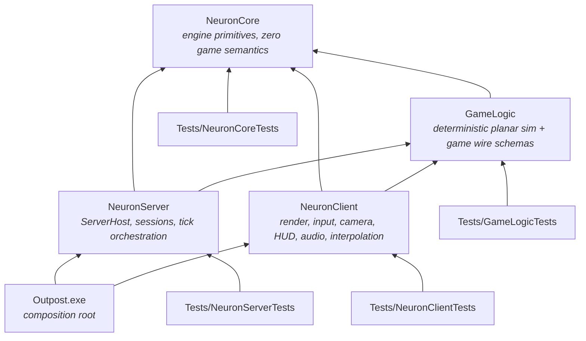

# Dependency Map & Public Interfaces

**Status:** Session output 2026-08-17 · refines the fixed dependency rules from the brief.
Header-level contracts only — signatures live in code. Namespaces: **`Neuron`** for the three
engine libraries and **`Game`** for GameLogic ([AGENTS.md](../AGENTS.md) §1 F9). File names are
flat per ADR-013 (no code subdirectories); the tables below are also the **file-name registry**
that keeps names unique repo-wide.

## The graph

Rules (hard, from the brief, unchanged): GameLogic depends **only** on NeuronCore. GameLogic
never references NeuronServer/NeuronClient. Nothing depends on the executable. Client and
server never depend on each other.

## Rulings made this session (refinements, not bends)

1. **Game wire schemas live in GameLogic** (`Snapshot.h`, `OrderMessages.h`), not NeuronCore.
   Snapshot and order payloads *are* game semantics; NeuronCore's charter forbids them.
   NeuronCore owns only the semantics-free layer: byte IO, JSON, framing, handshake/ping
   messages, transport. *(ADR-004.)*
2. **NeuronClient links GameLogic from day one** — not "later for prediction". Load-bearing
   uses now: shared `ValidateOrder` + reason codes (BounceParity), shared `SolveFormation`
   (real footprint preview), wire schemas, class table. The brief's "may depend" is exercised
   deliberately; any client use of GameLogic beyond these pure/read-only surfaces (e.g.
   mutating a world) is out of contract.
3. **The client never constructs an authoritative `World`.** It applies snapshots to a
   `ReplicatedView` (GameLogic type, quantised fields). When prediction arrives it will run a
   *separate* GameLogic world instance — never a reference to the server's. *(ADR-007 §5.)*
4. **NeuronCore's "zero game semantics" test:** every NeuronCore header must be plausible in
   an unrelated networked sim. A header mentioning ships, orders, formations, or hull classes
   is in the wrong library — flag it in review, no exceptions without a session decision.
5. **DirectXMath is toolchain, not a dependency.** It is header-only, OS-free SDK math, so
   **GameLogic includes it directly** without violating "GameLogic depends only on NeuronCore"
   (a rule about *our* libraries). There is no NeuronCore math header at all. *(ADR-010.)*
6. **The JSON parser is NeuronCore's**, and GameLogic uses it for universe content — in
   charter, since NeuronCore is GameLogic's permitted dependency. File *reading* stays in the
   hosts; GameLogic parses bytes. *(ADR-012.)*
7. **Surfaced, needs owner sign-off:** if the Schannel-flavour msquic package ever has to swap
   to the OpenSSL flavour (older-Windows support, cert-file loading), that is treated as
   *within* the existing "msquic via NuGet" approval — flagged here so the assumption is
   visible. *(ADR-003, Risk R3.)*

## Per-project contracts

### NeuronCore — engine primitives (static lib)
Allowed deps: Windows SDK (Win32, Winsock2, **DirectXMath**), msquic (NuGet), C++ standard
library. C++/WinRT only where genuinely useful (none identified in MVP).
**No math header** — DirectXMath is used natively at call sites (ADR-010).

| Area | Files | Notes |
|---|---|---|
| Foundation | `Assert.h` `Log.h` `Time.h` `Hash.h` (FNV-1a) `Random.h` (PCG32) | QPC wrappers; no game types anywhere below |
| Memory/containers | `Arena.h` `RingBuffer.h` (SPSC/MPSC) | std containers allowed; arenas for frame/tick scratch |
| Tasking | `TaskPool.h` (`Submit`, `WaitGroup`) | Boot bakes only in MVP (ADR-007 §4) |
| Telemetry | `Telemetry.h` (`NEURON_COUNTER`, `NEURON_SPAN`, lane registry) | Per-lane SPSC rings, owner-drained |
| Serialization | `ByteReader.h` `ByteWriter.h` | Bounds-checked, little-endian |
| JSON | `Json.h` (flat-node DOM, iterative parse, `int64`-exact numbers, diagnostics) `JsonWriter.h` (strict output) | Config + universe + sound banks (ADR-012 §C) |
| Transport | `Transport.h` (`Transport`, `Connection`, `Listener`, `Stats`) `UdpTransport.h` `QuicTransport.h` | QUIC-shaped contract, `Poll()` delivery, 1,152 B datagram cap (ADR-003) |
| Wire (semantics-free) | `Wire.h` (framing, `Hello/Welcome/UpdateRequired/Refuse/Ping/Pong/Goodbye`) | Schema-hash mechanism lives here; game payloads do not |

### GameLogic — deterministic sim (static lib)
Allowed deps: **NeuronCore only**, plus DirectXMath as toolchain (ruling 5). No Windows
headers, no rendering, no sockets, no clock, no file IO.

| Area | Files | Notes |
|---|---|---|
| Identity | `Ids.h` (`ShipId`, `WingId`, `OrderId`, `SystemId`, `CelestialId`, `StationId`, `GateId`) `ShipClass.h` | 11-value closed taxonomy; Fighter/Cruiser reserved ids (ADR-009 §6) |
| Universe | `Universe.h` (`UniversePos{i64,i64}`, `UniverseDef`, region/system/celestial/station/gate tables, `GridAnchor`) `UniverseParse.h` (JSON bytes → `UniverseDef`, pure) | Exact integer metres; `universeHash` over canonical parsed content (ADR-012 §D) |
| World | `World.h` (authoritative tables + `Tick(orders[])`) `ReplicatedView.h` (quantised client view + `ApplySnapshot`) | Single-writer; owner asserts in debug; state stored as `XMFLOAT2` (ADR-010 §3) |
| Orders | `Orders.h` (`OrderSubmit`, `OrderGroup`, 4-leg queue) `Validate.h` (`ValidateOrder`, `ReasonCode`) | Validation consumes wire-quantised values only (ADR-005 §4) |
| Formations | `Formation.h` (`FormationId{Line,Wedge,Claw}`, `SolveFormation`) | Pure; client footprint preview calls this exact function |
| Wire | `Snapshot.h` `OrderMessages.h` `SchemaHash.h` | Message structs + Read/Write + schema string (ADR-004) |
| Test hooks | `WorldHash.h` (FNV over state) | Replay determinism harness |

### NeuronServer — hosting the authority (static lib)
Allowed deps: NeuronCore, GameLogic.

| Area | Files | Notes |
|---|---|---|
| Host | `ServerHost.h` (`Start/Stop/Join`) `ServerConfig.h` (plain struct, assembled by the exe) | The future OutpostServer.exe API, verbatim (ADR-008) |
| Sessions | `Session.h` (per-connection state, handshake, order seq/ack bookkeeping) | Session *table*; empty server keeps ticking |
| Replication | `SnapshotSender.h` (emit → datagram per client) | Per-client path; interest/delta land here later |

### NeuronClient — the player's machine (static lib)
Allowed deps: NeuronCore, GameLogic, Windows SDK (D3D12, DXGI, DirectXMath, DirectWrite for
the atlas bake, **XAudio2 + X3DAudio**).

| Area | Files | Notes |
|---|---|---|
| App | `ClientApp.h` (`Run`) `ClientConfig.h` (plain struct) `Window.h` | Frame loop on Main thread (ADR-007) |
| Net/state | `ClientConnection.h` (handshake, ping) `SnapshotBuffer.h` (ring, interp/extrap ≤250 ms, STALE) | Feeds Extract only |
| Extract | `RenderWorld.h` (`InstanceRecord`, overlay lists, HUD state) | The future Game/Render thread seam |
| GPU | `GpuDevice.h` `GpuSwapChain.h` `GpuUploadRing.h` `GpuPasses.h` (Clear/Opaque/OverlayWorld/Ui) `GpuPipelines.h` | Fixed pass list w/ reserved slots (ADR-006) |
| Assets | `ObjMesh.h` (loader → submesh ranges) `GlyphAtlas.h` (DWrite bake) | Boot-time, TaskPool |
| Camera/input | `IsoCamera.h` (ortho 30°, yaw snap, zoom) `Picking.h` (`XMPlaneIntersectLine` + 2D tests) `InputMap.h` | Client-only state |
| HUD | `HudLayout.h` `HudRoster.h` (context bar, ability rack stub, toasts) `OrderPuck.h` (drag/facing/ghost lifecycle) | Prints are the spec |
| Audio | `AudioSystem.h` (XAudio2 graph, voice pool) `AudioListener.h` (focus/zoom listener model) `AudioBank.h` (JSON bank + RIFF WAV) | 5 submixes; `AudioUpdate` stage after Extract (ADR-011) |

### Outpost.exe — composition root
Allowed deps: NeuronServer, NeuronClient (and transitively the rest). Files: `Main.cpp`
(`wWinMain`, **arguments ignored**), `ConfigLoad.h/.cpp` (locate + parse + merge
`Outpost.json` and the user layer), `AppConfig.h/.cpp` (JSON → `ServerConfig`/`ClientConfig`
structs), boot/shutdown ordering (ADR-008), `selfTest` driver. **Nothing else.** Nothing
depends on it.

### Tests/* — VS CppUnitTestFramework (added on main, 2026-08-17)
Each test project depends on its library under test plus that library's allowed deps.
- `GameLogicTests` — replay determinism (double-run hash equality), wire round-trip/underrun,
  formation geometry, validation parity (quantised inputs), universe JSON parse round-trip +
  rejection, `universeHash` stability, anchor+local reconstruction.
- `NeuronCoreTests` — byte IO, ring buffers, **JSON conformance corpus** (valid/invalid,
  `int64` exactness past 2⁵³, depth cap, duplicate keys, escapes/surrogates, writer
  round-trip), UDP loopback handshake (real socket).
- `NeuronServerTests` — `ServerHost` start/stop/join, session handshake against a raw
  core-level client, config structs built in code (no files).
- `NeuronClientTests` — interpolation/extrapolation timeline, picking math, OBJ parser, audio
  listener/emitter math, sound-bank parsing. **No D3D device and no audio device in unit
  tests**; GPU/audio smoke lives in `selfTest`-adjacent manual slices.

> Repo observation: the freshly added test .vcxprojs contain **no ProjectReference yet** to
> the libraries they test (and will need include paths to match). Project files are
> owner-maintained per the brief — flagged here rather than edited.

## Include discipline (ADR-013)

- **Flat project folders**, no code subdirectories; IDE grouping via `.vcxproj.filters`.
- **File names are unique repo-wide** — the tables above are the registry; check before adding.
- `$(SolutionDir)` is the single additional include root, so cross-project includes are
  project-qualified: `#include "NeuronCore/Json.h"`, `#include "GameLogic/Snapshot.h"`.
  Within a project, plain `#include "Json.h"`.
  *(Owner action: the vcxprojs currently list each project folder individually; switching to
  `$(SolutionDir)` alone enables the qualified form.)*
- A project's non-exported headers are simply those no other project includes; there is no
  `Public/` folder split (dropped by ADR-013).
