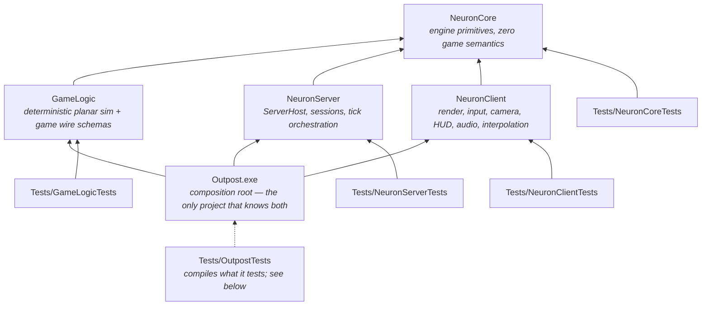

# Dependency Map & Public Interfaces

**Status:** Session output 2026-08-17 · **revised 2026-08-18 after S9.** Refines the fixed
dependency rules from the brief. Header-level contracts only — signatures live in code.
Namespaces: **`Neuron`** for the three engine libraries and **`Game`** for GameLogic
([AGENTS.md](../AGENTS.md) §1 F9). File names are flat per ADR-013 (no code subdirectories);
the tables below are also the **file-name registry** that keeps names unique repo-wide.

**The tables are a plan as much as an inventory.** A file marked *(planned)* has a slice and a
charter and no code yet; everything unmarked is in the tree. The distinction matters because
the registry's job is to reserve a name *before* the file exists (ADR-013 §4), so a planned row
is doing real work rather than describing something that is missing.

## The graph

Rules (hard): GameLogic depends **only** on NeuronCore. GameLogic never references
NeuronServer/NeuronClient. Nothing depends on the executable. Client and server never depend on
each other. **The engine libraries never reference GameLogic** — `Outpost.exe` is the only
project that knows both, and the seam is dependency inversion (ADR-014). The brief permitted
`NeuronClient`/`NeuronServer` to depend on GameLogic; that permission is deliberately declined,
because `Neuron*` is a shared engine serving a second game in the sibling repository.

## Rulings made this session (refinements, not bends)

1. **Game wire schemas live in GameLogic** (`Snapshot.h`, `OrderMessages.h`), not NeuronCore.
   Snapshot and order payloads *are* game semantics; NeuronCore's charter forbids them.
   NeuronCore owns only the semantics-free layer: byte IO, JSON, framing, handshake/ping
   messages, transport. *(ADR-004.)*
2. ~~NeuronClient links GameLogic from day one.~~ **Overturned by ADR-014.** The client needs
   GameLogic *code* (BounceParity's `ValidateOrder`, the footprint's `SolveFormation`) but not
   a GameLogic *dependency*: it declares `Neuron::WorldView`, and `Outpost.exe` implements it
   by forwarding to GameLogic's pure functions. Same function, same reason codes, same bounce —
   reached through an interface rather than a link-time symbol. *(The vtable sits in the
   executable rather than in GameLogic because `WorldView.h` is NeuronClient's; ADR-014 §2a
   records why that is the right side of the trade.)*
3. **The client never constructs an authoritative `World`.** It applies snapshots to a
   `ReplicatedView` (GameLogic type, quantised fields). When prediction arrives it will run a
   *separate* GameLogic world instance — never a reference to the server's. *(ADR-007 §5.)*
4. **NeuronCore's "zero game semantics" test:** every NeuronCore header must be plausible in
   an unrelated networked sim. A header mentioning ships, orders, formations, or hull classes
   is in the wrong library — flag it in review, no exceptions without a session decision.
5. **DirectXMath is toolchain, not a dependency.** It is header-only, OS-free SDK math, so
   **GameLogic includes it directly** without violating "GameLogic depends only on NeuronCore"
   (a rule about *our* libraries). There is no NeuronCore math header at all. *(ADR-010.)*
6. **The JSON parser is NeuronCore's**, and GameLogic uses it for universe content — in
   charter, since NeuronCore is GameLogic's permitted dependency. File *reading* stays in the
   hosts; GameLogic parses bytes. *(ADR-012.)*
7. **Surfaced, needs owner sign-off:** if the Schannel-flavour msquic package ever has to swap
   to the OpenSSL flavour (older-Windows support, cert-file loading), that is treated as
   *within* the existing "msquic via NuGet" approval — flagged here so the assumption is
   visible. *(ADR-003, Risk R3.)*

## Per-project contracts

### NeuronCore — engine primitives (static lib)
Allowed deps: Windows SDK (Win32, Winsock2, **DirectXMath**), msquic (NuGet), C++ standard
library. C++/WinRT only where genuinely useful (none identified in MVP).
**No math header** — DirectXMath is used natively at call sites (ADR-010).

| Area | Files | Notes |
|---|---|---|
| Foundation | `Debug.h` (asserts) `Log.h` `Clock.h` (QPC + `WaitableTimer`) `Hash.h` (FNV-1a) `Random.h` (PCG32) `OwnerThread.h` (`Claim`/`Release`/`NEURON_ASSERT_OWNER`) | Named to avoid shadowing `<assert.h>`/`<time.h>` (ADR-013 §3a); no game types anywhere below. `OwnerThread` is here rather than in GameLogic because a thread id is an OS concept and GameLogic is OS-free — what the game embeds is the object, never the id. Debug-only, and never simulation state: an owner id that reached the world hash would make a replay depend on which thread ran it (ADR-007 §7) |
| Memory/containers | `Arena.h` `RingBuffer.h` (`RingBuffer` SPSC + `MpscRingBuffer`) | std containers allowed; arenas for frame/tick scratch. Both bounded and allocation-free: a full queue drops and counts rather than stalling the thread that pushed |
| Tasking | `TaskPool.h` (`Submit`, `WaitGroup`, `Wait`) | Boot bakes only in MVP (ADR-007 §4). Mutex + condvar + `std::function` on purpose: a lock-free queue here would be fixed-capacity and would have to drop work, which for a mesh load is a bug rather than a trade |
| Telemetry | `Telemetry.h` (`NEURON_COUNTER`, `NEURON_SPAN`, lane registry, `TelemetrySnapshot`) | Per-lane SPSC rings drained by one collector; cap 16; a lane is a role, not a thread, so re-registering a name adopts it. Compiled into Release — `tickOverrun` ships (ADR-002) |
| Serialization | `ByteReader.h` `ByteWriter.h` `EntityRecord.h` (`EntityId`, `EntityRecord`, `ENTITY_RECORD_BYTES`, `SameEntityState`) `OrderIntent.h` | Bounds-checked, little-endian; `EntityRecord` is the neutral **23-byte** replication record the engine speaks instead of a game type (ADR-014 §3) — 20 at S7, 21 when ADR-017 §5 spent a status byte, and 23 as of U3d-b, the id having widened to u32 once ADR-022 §5b removed the everything-in-one-datagram constraint that had held it. `EntityId` is a named alias rather than a bare `std::uint32_t`, and it earns its keep for the reason `Game::Ids.h` gives for *not* using one: the client's seams pass entity ids and grid ids side by side, both were `std::uint16_t`, and when one widened the compiler had nothing to say about the dozens of sites that had to widen with it. `SameEntityState` is field-by-field rather than `memcmp` or a defaulted `operator==`, because the compiler pads this type and padding would make two identical records compare different at random — which is the whole of delta encoding getting it wrong; its spare third byte was renamed `flags` → `groupId` in S11b so a ship's wing could ride across as a number the engine carries and does not read. `OrderIntent.h` carries the command half of both seams — `OrderIntent`/`OrderVerdict`/`OrderPreview`, plus S9's `OrderDefaults` (which command the puck makes), S10's `OrderOption` (which parameters that command accepts, and what to call them), S11d's `OrderKindOption` (which commands *exist*, what they are called, and which this build has content for) and `OrderProgress`/`OrderFeedback` (what the authority is still working on). S11c gave `OrderPreview` the ghost's two label numbers — `etaSeconds` and a fixed `label` buffer — because the engine can compute the kilometres from two points it holds but not the seconds (that needs a movement model) and not the words (`MOVE` is a kind and `CLAW` a formation). The label is a buffer rather than a `const char*`, unlike `OrderOption::name`, because a ghost *keeps* its preview for as long as the order is in flight and a pointer into the world view would by then describe whatever was previewed next. Here rather than beside either seam because `WorldView::PreCheck` and `Simulation::ApplyOrderBytes` must return the same verdict type and NeuronClient cannot see NeuronServer (ADR-014 §2b) |
| JSON | `Json.h` (flat-node DOM, iterative parse, `int64`-exact numbers, diagnostics) `JsonWriter.h` (strict output) | Config + universe + sound banks (ADR-012 §C) |
| Transport | `Transport.h` (`Transport`, `Connection`, `Listener`, `Stats`, `TransportChannel{Control,State,Bulk}`, `MAX_DATAGRAM_BYTES`, `MAX_BULK_BYTES`) `QuicTransport.h` | QUIC-shaped contract, `Poll()` delivery, 1,152 B datagram cap (ADR-003); msquic only since S13 — `UdpTransport.h` deleted by owner directive. **Three channels as of U3d-b** ([ADR-022](ADR/ADR-022-interest-and-delta.md) §3c, amending ADR-003 §1): `Bulk` is a second reliable ordered stream so a keyframe — a *baseline* rather than fresh state, ~24 KB at ADR-018 D4's cap — does not queue in front of the player's orders. It is the client's second bidirectional stream and is identified by its **QUIC stream id** (4) rather than by which `PEER_STREAM_STARTED` arrived first, because msquic promises nothing about that ordering and channels that could swap under load would be a bug nobody could reproduce. Its own reassembly buffer, because the two streams interleave and a shared one would splice a frame. `MAX_BULK_BYTES` is 65,535 — what the two-byte length prefix can express, so the cap is the framing's rather than somebody's preference |
| Wire (semantics-free) | `Wire.h` (framing, `Hello/Welcome/UpdateRequired/Refuse/Ping/Pong/Goodbye`) | Schema-hash mechanism lives here; game payloads do not. `ViewRequest`/`ViewChanged` (U3b) are fully described here, unlike the opaque three: a world id and a verdict are numbers this library defines the shape of, even though what makes a view *legal* is the game's (ADR-016 §7). Three type words carry opaque game bytes — `Snapshot`, `OrderSubmit` and, as of A13, **`Summary`: one type for ADR-016 §6's whole family**, because which member a payload carries is a distinction the game draws inside its own bytes. Adding it did not bump `PROTOCOL_VERSION`: no existing message's layout moved, an older build ignores an unknown type, and what fails a mismatch closed is the *game* schema hash |

### GameLogic — deterministic sim (static lib)
Allowed deps: **NeuronCore only**, plus DirectXMath as toolchain (ruling 5). No Windows
headers, no rendering, no sockets, no clock, no file IO.

| Area | Files | Notes |
|---|---|---|
| Identity | `Ids.h` (`ShipId`, `WingId`, `OrderId`, `SystemId`, `CelestialId`, `StationId`, `GateId`) `ShipClass.h` | 12-value taxonomy; Fighter/Cruiser reserved ids (ADR-009 §6), `Gate` appended as the twelfth by U4 (ADR-016 §10) |
| Universe | `Ids.h` (`RegionId`/`SystemId`/`CelestialId`/`StationId`/`GateId`, all `u16`, authored not assigned) `Universe.h` (`UniversePos{i64,i64}`, `UniverseDef`, region/constellation/system/celestial/station/gate/**anchor** tables, `GridAnchor`, `LocalFromUniverse`/`UniverseFromLocal`, `PairedGateAnchor` — the far side of a gate, which is a question about content and not about the runtime) `UniverseParse.h` (JSON bytes → `UniverseDef`, pure) `UniverseRoute.h` (`SolveRoute`, `FindSystems` — the strategic map's two non-drawing questions, pure over the bake, ADR-018 D14; breadth-first because a gate is a gate, ties broken by system id so two equally short routes are *the same* route on both machines) `UniverseGen.h` (the bake — pure, **integer-only**, one seeded PCG32: regions, constellations, systems, the gate graph, celestials at real orbital scales, stations, and the **anchor table** ADR-016 §3 makes the only warp destinations; plus the JSON that expresses it) | Exact integer metres — **no float anywhere in the model**, which is what makes the hash and the reconstruction exact; `universeHash` over canonical parsed content, walked in id order so reordering a file is not a content change (ADR-012 §D) |
| World | `World.h` (SoA tables, `ShipId`↔slot indirection, seeded `Pcg32`, the `OrderGroup` table, `Tick` = IngestOrders → GroupAdvance → Steering → Integrate → Separate) — implemented by **two** translation units, `World.cpp` and `WorldOrders.cpp`, which is the one place in the tree where a header has more than one (ADR-013 §3) `ShipClass.h` (the taxonomy, compiled in — movement envelope, contact radii per ADR-015, and the cosmetic hover/bank constants per S14; eleven until U4 appended `Gate`, whose two radii are taken from `Stargate.obj`'s own silhouette) `WorldHash.h` (FNV over raw state bits) | Single-writer; state stored as `XMFLOAT2` (ADR-010 §3); guidance carries a resolved target rather than ADR-005 §1's `groupRef` so Steering never learns groups exist; Steering also brakes for and deflects around traffic and `Separate` projects residual overlap after Integrate (ADR-015 — positions move, velocities never, stations are terrain); the hash folds float *bits* because same-binary replay means bit-identical, and folds the group table so a queued plan is part of world state. **A finished group lingers before it is retired** (`ORDER_DONE_LINGER_TICKS`, 30 ticks): a client ghost retires on *seeing* `Done` in a snapshot, so a table that dropped the row the tick it finished would race the thing that reads it. `doneTick` is therefore simulation state and is folded into the hash — it decides the tick the group leaves the table, and two worlds equal in everything else but differing here diverge exactly there |
| Station | `Station.h` (`RosterEntry`, `RosterView`, `StationVerb`, `StationCommand`, `ValidateStationCommand`, `UNDOCK_PROTECTION_SECONDS`) | Docked ships are rows, not hulls (ADR-017 §1) — `(ShipId, class, wing)` at the universe layer, which buys clutter prevention by construction, leaves the grid-teardown rule untouched, and costs no snapshot bytes and no tick time. **No gauges, and that *is* the repair rule:** undocking spawns a ship full because the roster had nothing to damage. Undocking is not an order on world ships — there are none to name — so it is a *station command*, validated by one pure function over the replicated roster both halves hold, sharing the order stream's sequence, ack and reason enum. No `World` in this header, deliberately: that is what makes the client able to call it. Wings are emergent (§6) — a wing exists iff a ship carries its number, so there is no wing table to desync and disbanding is reassigning the last member. Since I2 the view carries a **grid** beside its station and `RequiresDock` splits off `NamesShips`: a wing may be formed wherever the ships are, while `Undock` and the transfer verbs still need the roster |
| Event record | `EventRecord.h` (`EventKind`, `EventEntry`, `EventRecord::Emit`) | One append-only, per-commander stream at the universe layer (ADR-018 D19), built with one consumer because four surfaces are already designed on it — the toast backlog and its UNREAD count, REVIEW LOSSES, the reconnect away-log and the strategic feed — and four consumers of four producers would be four bugs about the same ten events. **Not hashed, deliberately:** an event describes something the simulation already did, so folding the description in would make a replay depend on how talkative the build was. Three numbers and no text: a string here could not be translated, the client already knows how to name a station, and `count` is what makes "eight ships docked at Vesta-3" one line instead of eight. Capped at 512 with the drop **counted**, because "your log starts here because it was full" is a different statement from "nothing happened before this" |
| Universe runtime | `WorldRegistry.h` (`RosterEntry`, `RegistryConfig`, `Borrow`/`Peek`/`Tick`/`Spawn`/`Despawn`/`AddViewer`/`RemoveViewer`/`HostForAnchor`/`AllocateShipId`/`LocationOf`/`OwnerOf`/`HasPresence`/`Roster`/`DockedFor`/`Summaries`/`Ledger`/`Ledgers`/`FieldAt`/`Hash`/`HandOff`) `Transfer.h` (`HostId`, `TransferId`, `TransferKind`, `TransferMember`, `TransferRequest`, `TransferRecord`, `WARP_BASE_SECONDS`, `TRANSFER_FLOOR_TICKS`, `GATE_JUMP_TICKS` — the last of those in *ticks* rather than seconds, because a flat price should not arrive by a division that truncates) | The many-grids layer a session actually runs: which anchors are live, what is on each, where any ship is, and the one shard tick they all advance on (ADR-016 §4, U2). Shaped by [ADR-019](ADR/ADR-019-shard-topology.md) even though it runs in one process — worlds are addressed by `AnchorId` and never by a pointer held across a tick, `HostForAnchor` exists and returns zero, and player-scoped questions go through `LocationOf` rather than a walk; at `HostId = 0` that costs a type and a function returning a constant. It is the one file outside the universe area that may read a `UniverseDef` — it looks an anchor up and never does math on a position, which is why the CI determinism guard excludes it from the *content* rule and not the *coordinate* one. Authored occupants get the ids the bake derived from their anchor (ADR-018 D6a), which is what makes teardown and recreate reproduce a world exactly; dynamic ids come out of a separate block. **Worlds forget** — nothing is saved on the way out, and a ship-less world held alive only by a viewer is outside the hash (ADR-018 D8), or where a camera pointed would be a simulation input. T1 added the other half of that rule: the **station rosters and the transfer bus** are universe-layer state that outlives the grids, so a station grid tears down with a full roster and the roster is untouched. Transfers apply **between** ticks in `(applyTick, transferId)` order (ADR-018 D17) — filed by a world during its tick, stamped by the registry because the counter is the host's and a world minting its own would give two grids one number, applied before any world runs again. Rosters and the in-flight bus fold into `Hash`: a replay is the order logs *plus* the transfer log. E2 added the third resident of that rule — the **site ledgers** (ADR-024 §3d), what has been mined out of each field since its last epoch. A ledger exists only once something has been *taken*, so "no ledger" and "the bake's pools, untouched" are the same statement and the durable set is proportional to what is being mined rather than to the six thousand fields the bake authored. **The epoch applies only at spin-up** — refill, re-bearing, reshuffle — because a field is never re-formed under a live grid, and dropping a passed epoch's row *is* the refill. One rule of D8 is carried through to the fold: a ledger the shard owes a refill is skipped, or whether anybody happened to spin a grid up and notice would change the session's hash. `Spawn`/`Despawn` exist beside `Borrow` because the ship→location index is the registry's to keep, and a ship placed through a borrowed world would be missing from it. **And the ship→owner index beside it (U3c-a, ADR-018 D5):** who owns a hull is durable state, so D2 puts it here rather than in `World` — a player identity inside the deterministic SoA would put accounts in the replay domain and make a two-commander shard hash differently from the same shard with one. It is maintained and cleared with the location, in one call, so the invariant is one sentence: *a ship the registry cannot locate is a ship it has no owner for.* Authored occupants are `INVALID_PLAYER_ID`, which is what makes `Summaries` free of its old `ShipCount() - authoredCount` special case and what stops an anonymous handshake reading as a skeleton key. `Roster` still answers with the whole station for the two callers that need it — grid teardown and the save file — and `DockedFor` is what anything reaching a player uses, including the validator's own view: an unfiltered roster there is not a display bug but an authority one, since a commander could name another's hull in an `Undock` and be believed |
| Wire (acked stream) | `OrderMessages.h` (`CommandKind`, `WriteCommandKind`/`ReadCommandKind`, `OrderSubmit` ↔ bytes) | ADR-017 §8 put station commands on the *acked order stream* rather than a stream of their own — one sequence, one `OrderAck`, one reason enum — so `CommandKind` leads every payload. It has to: both messages open `u32 orderSeq` and then a byte whose value spaces overlap (`OrderKind::Move` and `StationVerb::Undock` are both zero), so nothing in either body could say which it was. Same shape as `SummaryKind` in the other direction — **one engine wire type, a game-owned byte inside it** — because spending a second enumerator of NeuronCore's framing enum on a station command would teach the engine that stations exist |
| Economy | `EconomyDef.h` (`OreId`/`AlloyId`/`SiteArchetype`/`SecurityBand` — closed taxonomies, because each is a wire value and an array index at once, the `HullClass` precedent; `EconomyDef` and its per-hull `CargoInfo`, recipes, site grades and archetypes, refinery tiers and upgrade projects; `ComputeEconomyHash`; `MixContentHashes`) `EconomyParse.h` (JSON bytes → `EconomyDef`, pure) | **The first balance content in the tree** (ADR-024 §7, cashing in ADR-012 §D13): the ship class table stays compiled because movement is not economy, while litres, recipes and site distribution are authored and hash-guarded. Everything is stored **indexed by its taxonomy rather than in file order**, which is what makes `economyHash` order-independent by construction — reordering `Economy.json` cannot move it and changing a value always does. Integers only: a hold is full when `usedLitres + unitVolume > capacityLitres`, and a float there would let two clients disagree about the same hold. The parser refuses structure, ranges and referential integrity; **balance shape is asserted in the suite, not the parser**, so retuning the economy is editing a file |
| Sites | `SiteEpoch.h` (`SitePlacement`, `SiteEpochIndex`, `SiteEpochPlacement`, `ResolveSiteEpoch`) `SiteField.h` (`SiteCluster`, `SiteField`, `SiteLedger`, `OreFilter`, `BuildSiteField`, `RichestCluster`, `ClusterOre`, `MiningCycleTicks`, `CycleHeat`, `SensorDampingPct`, `TICKS_PER_SECOND`, `MAX_SITE_CLUSTERS`) `FixedAngle.h` (the fixed-point sine table, `SinStep`/`CosStep`/`PolarOffset`) | **Where a mining field is *today*** (ADR-024 §3a, ruling R7). The bake authors a site's orbit ring and the bearing on it is re-derived every epoch, so the field re-forms overnight and scouting goes stale — while ambush survives, because arrival scatter rather than relocation is what dilutes a camp. Pure and integer-only, and called by **both halves**: the client draws today's field from it and the sim spins today's world up from it, so a float here would be two machines disagreeing about where a system's ore is. `FixedAngle.h` carries the table `UniverseGen.cpp` kept privately until a second, *runtime* consumer arrived — the alternative was two copies that had to stay equal by everyone remembering. **`SiteField.h` is the other half and sits on the other side of the ADR-009 §2 line**: a cluster is a *local* offset in the grid's own centimetres and a pool is an integer, so the tick may hold one, while where the grid sits on the plane stays spin-up work. It splits a pool by largest-remainder so the units handed out sum to the pool exactly — a field that leaked a unit to rounding could never report itself exhausted — and places centres by rejection in the disc rather than polar, because polar would need the sine table the tick is not allowed to reach for |
| Refining | `Refining.h` (`RefinePlan`, `PlanRefine`, `FindRefineBatch`, `BandTierCap`, `TierCooks`, `AuthoredStationTier`, `RefineJob`, `UpgradeProject`, `StationTier`) | **A refinery is a ledger** (ADR-024 §6, E4b), so this is integer-only and has deliberately nowhere to put an RNG: batching is the deterministic economy's answer to yield variance, and the ME refund is exact and floored *per material* -- a refund computed on the total and split afterwards would have to decide which ore eats the remainder, and there is no answer to that which is not an invention. A job is **priced once, at submission**, and carries its plan: the print shows that arithmetic before the player commits, so the numbers they agreed to are the numbers they get, and a reloaded job needs no tier table to know what it owes. **The order of the arithmetic is a stated contract** -- two builds applying the same three integer factors in a different sequence would price the same job differently and nothing else would notice. `TierAt` clamps by the band on the way *out* rather than trusting every path that could raise a tier, which is what keeps "no High-Sec station can ever cook Nova-Steel" true against a project, a reload or a retune |
| Persistence | `DurableState.h` (`DurableState`, `DurableShip`, `DurableRoster`, `PersistenceDiagnostic`, `CaptureDurableState`, `WriteDurableState`, `ReadDurableState`, `DurableHash`, `DURABLE_FORMAT_VERSION`, `DURABLE_MAGIC`) | **The durable line, drawn where ADR-025 §1 draws it**: a ship's identity and where it is are durable, its intentions and its motion are not -- so a fleet reloads at rest with an empty queue, because the fleet is the player's property and the order was the player's intention. Pure like everything else here: bytes in, bytes out, diagnostics on malformed input, never a path and never a throw, which is the `ParseUniverse`/`ParseEconomy` posture applied to a binary format and what keeps the round-trip suite fixture-free. **`DurableHash` is not `WorldRegistry::Hash`** and the distinction is load-bearing (§1a): that one folds the order queues §1 has just declared transient, so a correct reload cannot reproduce it and a check written against it would teach everyone to ignore a red test. Authored occupants are **not** written -- spin-up rebuilds them from the bake (ADR-018 D6a), so a save file carrying them would be storing content and then arguing with it after a re-bake. Every count is folded before the things it counts, because the failure this hash exists to catch is *loss* and a count-free fold is blind to exactly that. Two refusals rather than repairs: a load into a running registry, and a ship-id high-water mark that would go backwards |
| Mining | `WorldMining.cpp` (`World::Mining`, `World::OreHoldFreeLitres`, `World::SensorDampingPct`, `World::MiningEtaSeconds`) `World.h` (`ShipCargo`, `MiningState`, `SetSite`/`SetEconomy`/`Site`/`FieldEpoch`) | The third translation unit of `World`, on the seam the tick already draws (ADR-024 §4b, E2): `World.cpp` moves ships, `WorldOrders.cpp` runs the order pipeline, and this runs `Mining` — **last in the named step order**, so a cycle is judged against where a ship *finished* the tick rather than where steering was still arguing it should be. Yield is `min(cycleYield, what is left, what fits)` and **takes no draw at all**: an RNG call on the per-tick path is how a replay stops reproducing, so the suite asserts the world's generator is unmoved. Ore credits the hold and the debit rides the transfer bus as a `MineYield` record, which is what keeps universe coordinates off the tick without inventing a second mechanism. The three exits of §4b are per-ship: a full hold stops that ship, an exhausted cluster or a wing with no room left ends the order `Done` with the linger the client's ghost needs. Hazards land in their Phase-1 halves — radiation stacks that stretch the next cycle and shed only *outside* the rocks, nebula heat that locks the laser out and sheds only while it is off, and a per-grid sensor-damping percentage the relevance seam will read. **Ore does not survive a crossing yet**: `TransferMember` carries an id, a hull and a wing, and E3 is the slice that gives a crossing a manifest |
| Orders | `Orders.h` (`OrderKind`, `QueueMode`, `FormationId`, `OrderReason` + its text, `OrderLeg`, `OrderSubmit`, `OrderState`, and the names for a kind, a formation and a kind's parameter) `Validate.h` (`ValidationView`, `ValidateOrder`, `DockRadiusMetres`, `JUMP_RADIUS_METRES`) `Eta.h` (`TravelSeconds`, `RemainingSeconds`, `GroupTravelSeconds`) | Three files because they are three decisions and only the first needs a world (`Orders.h` is data, `Validate.h` decides, `OrderMessages.h` encodes). A leg is wire-quantised — centimetres and turns/65536 — because validation consumes quantised values only (ADR-005 §4), and a struct storing metres would make the mistake available. `Eta.h` is a *function of the class table* rather than a method on `World`, because two callers need it and only one of them has a world: the client's pre-check answers the ghost's label before the order is sent, and S12's authority answers it again per leg. Measured against the simulation it predicts: 0.4 % on a straight run, and always optimistic. S12 added the moving-start form and the authority replicates it per leg — a rest-to-rest estimate of a *remaining* journey charges a ramp the ships already paid and peaks at 44.8 % error as they arrive, against 2.4 % for this one. **The order of the checks is part of the contract:** an order failing two rules must fail the same one on both machines, or the player reads a different explanation depending on which answered. E2 added `Mine` and with it the first kind whose parameter is **not a formation** — an ore filter, carried beside `formation` rather than smuggled into it, because a Mine order is still flown in one and its escorts still take stations. Its three refusals slot into the sequence where their nouns belong: `NotAtSite` beside the other "is the place you named a place?" checks, `NoMinerInOrder` and `HoldFull` after ship resolution, where a question about the *selection* goes. The hold check is the first that one half of the pair **cannot answer** rather than merely answering staler — the client has no cargo until E3 replicates it — so a view without hold room defers instead of bouncing, which is designed and written down rather than a hole |
| Formations | `Formation.h` (`FormationId{Line,Wedge,Claw}`, `FORMATION_IDS`, `FormationName`, `SolveFormation`, `FormationExtentMetres`) | Pure, and the client's footprint preview calls this exact function through the seam. Assignment is by **ascending `ShipId`**: the client's selection and the server's dense table hold the same ships in different orders, and a solve that followed array order would put the preview one station out from where the fleet goes. All three shapes are solved as of S10, and two properties hold across them — each puts something exactly on the anchor, and adjacent stations are exactly one spacing apart. That spacing bought the MVP its "no inter-ship avoidance" (ADR-005 §2, spent by ADR-015); it now guarantees the finer claim that parked neighbours are never in contact — spacing ≥ 4·contact radius, table-tested — so a formation in flight never fights its own contact model |
| Summaries | `FleetSummary.h` (`FleetState`, `FleetSummary`, `FLEET_ETA_NONE`, `WriteFleetSummaries`/`ReadFleetSummaries`) | Where a commander's ships are without looking at any of them (ADR-016 §6, U3b's sim half). A fleet is emergent — your ships sharing a location — so this is a count grouped by place rather than a record of an entity, which is why there is no fleet id and nothing to keep in step. **A summary is not a snapshot:** a snapshot is one grid at 20 Hz, this is every place at ~1 Hz, and it exists so a client can show a fleet it is *not watching* — without it the answer to "what is my other fleet doing" is "subscribe to its grid", which is the clutter §6 refused. `anchor` is where the ships are for `OnGrid`/`Docked` and where they are **going** for `InTransit`, which is also where the transit ETA lives: a fleet mid-crossing is in no world, so no grid's order records can carry it — the number U3a owed. Ordered by anchor then state, so two runs of one script produce the same bytes |
| Wire (summary family) | `SummaryMessages.h` (`SummaryKind`, `BeginSummaryFrame`/`BeginSummaryRecord`, `ReadSummaryFrame`/`ReadSummaryRecord`) | The envelope ADR-016 §6's family travels in, and the reason it needs one: **`Neuron::WireType::Summary` is a single engine type for every member**, so the byte saying which member a record carries is the game's and lives under the game's hash. An enumerator per kind would spend a slot of the engine's framing enum on every game concept that ever wants a 1 Hz feed — the coupling ADR-014 §5 keeps out of NeuronCore. A frame is a count and then that many `(kind, body)` records, with **no length prefix**, because every body in the family already begins with its own row count and has fixed-width rows. The price of that is a reader cannot *skip* a kind it does not know, and the answer is that it must not try: an unknown kind is a schema disagreement `GAME_SCHEMA_TEXT` refuses at the door, and a decoder that recovered from one would hide a version mismatch |
| Wire (economy) | `EconomyMessages.h` (`SiteStatusRow`/`CargoStatusRow` ↔ bytes, `BayStatus` ↔ bytes, `MakeSiteStatus`) | The three summaries E3 adds to ADR-016 §6's family, and the file exists because of what **cannot** carry them: `Neuron::EntityRecord` is 21 bytes and 43 fit one datagram against ADR-018's 41-ship floor, so one cargo byte would take the fit to 41 exactly — the arithmetic ADR-024 §4d refused in advance, and a test asserts it still holds. Cargo is a fact about *property*, it changes on the scale of a mining cycle rather than a tick, and a player who learns their hold filled a second late has lost nothing; a snapshot is for what moves. **`SiteStatus` is public and the other two are owner-only**, and that is a property of what the writer is *handed* rather than of a filter it applies — both are built from state keyed by the viewer, so no code path can write one commander's holds into another's frame. Per-cluster fullness is a **percentage, not a count**: a count would be the ledger replicated, which the client has no way to keep current, and 100/0 are reserved for untouched/empty so the bar cannot round a first dent away or a last cycle to nothing |
| Wire (station) | `StationMessages.h` (`StationCommand` ↔ bytes, `StationRoster` ↔ bytes) | `StationCommand` rides the reliable acked order stream, sharing its sequence, its `OrderAck` and its reason enum — one feedback loop for "I told the authority to do something", not two. `StationRoster` is the first resident of ADR-016 §6's summary family (~1 Hz), sent **per viewer**: ADR-017 §1's privacy rule is a wire fact from the first message, and on a broadcast-shaped sender it would be a silent leak nothing catches. **Ship ids are u32 here** (ADR-018 A11/D6) while the sim's stay u16 — a roster is what a reconnect screen reads and what a save file would hold, so the field that has to widen later is a schema break later. An id past this build's range narrows to `INVALID_SHIP_ID` rather than truncating, because a truncating cast would validate a command against the wrong hull |
| Wire | `Snapshot.h` (**the game's tick *tail*** as of U3d-b: the `OrderStateRecord` area and the `lastOrderSeqProcessed` high-water mark the session passes in, plus `MakeShipRecord`'s quantisation and the `statusBits` meanings — the snapshot's envelope moved to the engine with ADR-022 §1) `ReplicatedView.h` (client's quantised shadow + interpolation, and the newest snapshot's order records) `SchemaHash.h` `OrderMessages.h` (`OrderSubmit` ↔ bytes; the boundary a hostile payload stops at) | Full snapshots, no deltas, so loss is not a case to handle. The ship record is NeuronCore's `EntityRecord` rather than a `ShipRecord` of ours — ADR-004 §6 specifies exactly those twenty bytes and two matching layouts would eventually diverge. The schema string covers the **quantisation constants**, not just the fields. The order area is *reserved* rather than taking whatever is left, so the ship cap is a constant and not a function of how busy the player has been; orders are also the half that may truncate, because a missing ship reads as a despawn and a missing order costs one frame of ETA |
| Interest | `Relevance.h` (`Relationship`, `RelationshipOf`, `RelevanceQuery`, `RankRelevance`) | The game half of ADR-022 §4's relevance seam (U3d-a): **it ranks and never truncates**, because the caller knows the budget and the callee knows the game. That split is the whole design — a new hostility tier or a new "always show" case is an edit here that touches no engine code, and a budget change is an engine edit that touches no game rule. Tier 0 is owned, selected **and landmark**: there are one or two structures on a grid and they are what a player navigates by, so a station that flickered out of interest would take their sense of place with it. Nothing here is world state and nothing here is hashed — ranking is a *read*, performed per viewer outside the tick, which is what lets it depend on a camera without a replay depending on one. Two deliberate gaps, both recorded in the header rather than hidden: `Allied`/`Hostile` have no producer until the combat phase, and tier 1 therefore reads as "inside the camera's extent" rather than §4's literal conjunction, which taken literally would be empty by construction |
| Test hooks | `WorldHash.h` (FNV over state) | Replay determinism harness |

### NeuronServer — hosting the authority (static lib)
Allowed deps: **NeuronCore only** (ADR-014). It hosts *a* simulation, not *this* one.

| Area | Files | Notes |
|---|---|---|
| Seam | `Simulation.h` (`AdvanceTick`, `ApplyOrderBytes`, `RankRelevance`, `WriteEntities`, `WriteTickTail`, `WriteSummaries`, `MayView`, `PlayerJoined`, `WorldFor`, `WriteDurableState`, `ReadDurableState`, `DurableHash`, `SchemaHash`, `ContentHash`, `WorldMeta`, `SnapshotRequest`, `InterestQuery`) | Engine-declared, GameLogic-implemented, exe-injected (ADR-014 §2). `WriteSnapshot` and `WriteSummaries` both take a **`PlayerId` viewer** as of A13, and `WriteSnapshot` a **grid** as of U3b; `MayView` is the presence gate — the game decides whether a view is legal (ADR-016 §7 makes it a fact about where ships are) and the session role enforces the answer — the durable player and never the connection (D5). Today's implementation ignores it, and the seam may not: every replication decision after this one is a decision about a viewer, so a signature without one is a signature that changes at every call site on the day two clients see different worlds **U3c-b's two additions are both questions the engine must ASK rather than answer** (ADR-014 §3): `PlayerJoined` hands over a new commander's id and returns nothing, because what a commander is *given* is a game decision; `WorldFor` asks which grid that commander's session opens on, and returns a whole `WorldMeta` rather than an anchor id so the grid's number and its origin cannot disagree -- a client handed one with the other's origin draws its entire world in the wrong part of space. Both default to the shard-wide answer, which is what every session got while every session was the same commander. |
| Host | `ServerHost.h` (`Start/Stop/Join`, takes a `Simulation&`) `ServerConfig.h` (plain struct, assembled by the exe) | The future OutpostServer.exe API, verbatim (ADR-008) |
| Sessions | *(planned)* `Session.h` (per-connection state, handshake, order seq/ack bookkeeping) | Session *table*; empty server keeps ticking. Still `SessionInfo` in `ServerHost.h` — it earns a file when a second thing needs it. It now carries the durable `PlayerId` beside the connection id and **owns its client's `SnapshotSender`**: one session, one feed, constructed together so there is no window in which a session exists without the object that talks to it. **And a resume token, with `SessionResume.h`/`.cpp` beside it (U3c-b):** `ResumeTable` holds the sessions whose transport has gone and whose player has not — id, token, grid, deadline in TICKS — so a client back inside `SESSION_GRACE_SECONDS` is the same commander rather than a new one, picking up the grid it was watching. It is its own file rather than three more members here for one reason: **the whole of the grace window is decidable without a socket**, so it can be driven by a test instead of only by a four-minute live run. The token is a *resume handle and not a credential* and the header says so at length — nobody is authenticated, and whoever holds one is treated as the player; it is rotated on every use so a token seen once is worth one reconnect. `ServerHost` mints a `PlayerId` per **player**, starting at `SOLE_PLAYER_ID` so the first client is still player one, and calls `Simulation::PlayerJoined` only when it mints rather than when it resumes — which is the difference between arriving and coming back |
| Replication | `SnapshotSender.h` `SnapshotSender.cpp` (`Send`, `Viewer`, `SentCount`, `SummariesSent`, `NoteAck`, `NoteFocus`, `NoteOrderAccepted`, `LastOrderSeqProcessed`, `KeyframesSent`, `InterestOverrunCount`, `LastCulledCount`, `SetTickBudgetBytes`, `SUMMARY_INTERVAL_TICKS`, `DEFAULT_TICK_BUDGET_BYTES`) | **Per client from its first line** (ADR-018 A13, [ADR-022](ADR/ADR-022-interest-and-delta.md) §1) — the object that serialises is the object that knows a client, so there is no broadcast path to grow out of later. The bytes are identical for every client today and this buys nothing at runtime; the price is one serialisation per client instead of one per tick, paid while there is one client and it is zero. The over-cap refusal is counted and logged **here**, once per client, because "*which* client is over cap" is a question a global counter cannot answer. It also carries the summary cadence — ~1 Hz per ADR-016 §6, **staggered by viewer id** so a shard of hundreds does not serialise every session on the same tick, which costs a modulo now and a spike later. What ADR-022 adds to this file: the ring of views as sent (§2b), the last acked tick, and the keyframe path (§3) |
| Persistence | `DurableStore.h` `DurableStore.cpp` (`DurableStore`, `DurableStoreDesc`, `DurableLoadReport`, `DurableLoadResult`, `DurableReplayHandler`, `JOURNAL_FORMAT_VERSION`, `JOURNAL_FLUSH_MILLISECONDS`, `SNAPSHOT_INTERVAL_SECONDS`, `CHECKPOINT_INTERVAL_TICKS`, `MAX_DURABLE_RECORD_BYTES`) | Files, framing, checksums, flushing, snapshot rotation and torn-tail recovery (ADR-025 §3, §5, §6) -- and **it never learns what it is storing**. A record has a kind, a length and a checksum; that one of those kinds is a station Bay is a fact for the composition root. Not fastidiousness: `Neuron*` is a shared engine, so a store that knew what a Bay was would ship this game's vocabulary to the sibling repository. The distinction the boot path turns on is **torn tail versus corruption** -- a bad frame at the end is the write that was in flight when the power went, truncated and logged as a byte count; a bad frame with good frames after it cannot be an interrupted write, so it refuses and leaves both files untouched, because truncating there would throw away good state to make a bad file parse and the shard would come up looking healthy. Single-writer: the journal lane appends and flushes, and nothing here takes a lock because nothing here is shared. Every length is bounded before a byte of it is trusted |

### NeuronClient — the player's machine (static lib)
Allowed deps: **NeuronCore only**, plus the Windows SDK (D3D12, DXGI, DirectXMath, DirectWrite
for the atlas bake, **XAudio2 + X3DAudio**). No GameLogic (ADR-014).

| Area | Files | Notes |
|---|---|---|
| Seam | `WorldView.h` (`ApplyFrame`, `ReplicatedFrame`, `BuildScene`, `PreCheck`, `SolvePreview`, `EncodeOrder`, `DefaultOrder`, `OrderOptions`, `OrderKinds`, `PollOrderFeedback`, `BuildRoster`, `RenameGroup`, `BuildMapTopology`, `BuildMapOverlays`, `BuildMapLegend`, `BuildMapFacts`, `SolveMapRoute`, `ReasonText`, `SchemaHash`, `ContentHash`) + `NullWorldView`; the neutral types it speaks are `RenderScene` and `RosterRow` (here) and `OrderIntent`/`OrderVerdict`/`OrderPreview`/`OrderDefaults`/`OrderOption`/`OrderFeedback` (NeuronCore) | Engine-declared, exe-implemented, exe-injected (ADR-014 §2a); BounceParity runs the same function through it (§3). `FormationPreview` was renamed `OrderPreview` — the engine may name no formation (§2b). The last three arrived with S9's client half and each replaces a guess: which command the puck makes, what the authority is still working on, and what a reason code is called. `BuildRoster` is S11b's, and replaces the largest guess of the lot: the engine could group the replicated ships by `groupId` itself, and doing so would have decided in the engine that groups are named, that gauges average, and that an emptied group vanishes. `OrderKinds` is S11d's and stops the command row spelling `MOVE` and `ATTACK` in a two-game engine — a mistake no CI rule catches, because a string is not an include (ADR-014 §2c). **T3 adds `RenameGroup`** — the other end of `BuildGroupMembers`' opaque handle, and the first call that carries text *into* the game: the engine collects the characters and knows what its atlas can draw, and the game decides what a name may be and where it is kept. **U5a adds the map's five** — `BuildMapTopology`, `BuildMapOverlays`, `BuildMapLegend`, `BuildMapFacts`, `SolveMapRoute` — in ADR-020 §6's three shapes, and they are D14's leak test made structural: the engine holds a graph whose every word is the game's and whose colour is a `StandingColour` *class* rather than a value, so a client that could compute a security colour would be a client with an opinion about a second game's rules. `SolveMapRoute` takes only a destination — the origin is the game's, because the client holds a grid id and which system that grid is in is a fact about the universe |
| App | `ClientApp.h` (`Run`, takes a `WorldView&`) `ClientConfig.h` (plain struct) `Window.h` `ClearColour.h` | Frame loop on Main thread (ADR-007); `ClearColour` is deliberately free of D3D and C++/WinRT headers so presentation maths is testable without a device |
| Net/state | `ClientConnection.h` (handshake, ping, state-frame receipt, `SendOrder` on the reliable control channel, `SendViewFocus` on the unreliable one, `OrderAck` drained as `OrderVerdict`) `DeltaReceiver.h` `DeltaReceiver.cpp` (`ReplicatedFrame`, `OnDelta`, `OnKeyframe`, `TakeAck`) — the mirror of the sender's ring ([ADR-022](ADR/ADR-022-interest-and-delta.md) §2, U3d-b): both sides keep pictures keyed by tick, and a delta names the one it was encoded against. **Engine-side, because none of it knows what a ship is** — reassembly, baselines and the whole-tick ack rule are the same in any game that replicates against acked baselines (ADR-014 §4). Three refusals carry the design: a part naming a baseline this client does not hold is **refused, not misapplied** (§2b) and the missing ack is what asks for the keyframe; a tick is applied part by part for freshness but acked only when whole (§2d); a keyframe **replaces** rather than merging (§3). The game's tail rides through unread, exactly as a summary does `SnapshotBuffer.h` (slew-limited server-time estimate, render tick, staleness, drift) | The buffer owns the *clock*, not the payloads: it turns snapshot arrivals into a smooth render tick and the game answers what the world looks like at that instant. The estimate slews rather than tracking arrivals, because following jitter directly puts it straight on screen. Device-free, so the timing hardest to eyeball is the part most tested |
| Extract | `RenderWorld.h` (`InstanceRecord`, `SceneEntity`, `RenderScene`) `OverlayMark.h` (selection rings, gauge bars, order footprints and station ticks, in one 32-byte instanced stream) `OrderGhost.h` (PENDING → UNDER WAY → REJECTED, and the 150 ms bounce) | The future Game/Render thread seam. `InstanceRecord` is 24 bytes (S14 appended the cosmetic bank) *and is the per-instance vertex stream*, so its size is a static assert rather than a comment; `OverlayMark` is 32 for the same reason. A frame carries one `SceneEntity` per ship rather than three parallel arrays, so a ring is drawn exactly where a pick would have landed by construction rather than by two pieces of code being kept in step |
| GPU | `GpuCom.h` (`GpuPtr` = `winrt::com_ptr`) `GpuDevice.h` `GpuSwapChain.h` (+ the depth buffer and, since S14, the 4× MSAA colour target — the resources whose size is the swapchain's size) `GpuUploadRing.h` `UploadBudget.h` (how much one frame may put through that ring, derived from what the renderer is built to draw rather than from what it currently draws — ADR-018 A20; device-free, so the number is testable and the ring is handed it) `GpuMeshes.h` (VB/IB per class) `GpuLamps.h` (the signal-lamp table, one cbuffer built at boot) `GpuPasses.h` (Clear/**UiWorld**/Opaque/Nebula/OverlayWorld/Ui — the first five built as of S11a, `UiWorld` added 2026-08-19 as the list's second insertion: a *second `UiPass` instance* recording into the world target before `Opaque`, so the ghost's lane draws under the hulls, ADR-006 §1c) `GpuPipelines.h` (one PSO per pass, and two for `Ui` — the world-target one is multisampled) | Fixed pass list w/ reserved slots (ADR-006); COM ownership is `winrt::com_ptr` throughout, created via `IID_PPV_ARGS(x.put())` (AGENTS.md §5) |
| Assets | `ObjMesh.h` (loader → submesh ranges) `SignalLamp.h` (lamp vocabulary + placement from mesh bounds, ADR-006 §6a) `GlyphAtlas.h` (DWrite bake) | Boot-time, TaskPool. Both parsers are free of D3D and C++/WinRT headers so `NeuronClientTests` can drive them with no device |
| Camera/input | `IsoCamera.h` (ortho 30°, yaw snap, zoom, `PlaneMappingForNdc`) `Picking.h` (`PixelsToNdc` → `NdcToPlane` → circle and box tests, plus the inverse `PlaneToNdc`) `Selection.h` (a tap and what it does to the set, plus `Retain` — I2 took the press/move/release state machine away, because `Gesture.h` now owns when a tap happened and drag became the camera) `OrderPuck.h` (the right-drag: press names the place, the drag names the arrival facing) `InputMap.h` (`InputFrame` → `CameraIntent`; `Window` owns the virtual-key table, and `CycleParameter` is a key standing in for S11's command wheel — and, since I1, the **contact** model: what is touching the screen, oldest first, with the mouse's left button filling slot zero) `Gesture.h` (contacts → tap, drag, long-press, second finger, pinch — the pointer abstraction ADR-020 D15.4 refused and its 2026-08-22 amendment made the seam; device-free, decides nothing, and the mouse is expressed *through* it rather than beside it) | Client-only state, and **no ray**: the projection is orthographic and the world is a plane, so a pixel maps to a plane point through `PlaneMapping` and picking is a distance test against circles. That is what ADR-006 §2 bought by fixing the camera as ortho, and it is why all of this is a unit test rather than a screenshot. The one conversion lives in `Picking.h` so box-select, point-pick and the puck cannot drift apart (ADR-006 §11's "one code path") |
| Hud | `CountedChip.h` (U3d-c: the icon ladder's counted-chip rung, built for the first time — `culledCount` becomes a screen-space sentence rather than a mark on the plane, because a culled entity has no position the client can justify; zero says nothing) `SettingsScreen.h` (N3: the settings surface's zones, its five sections and their rows, laid out and hit-tested in one file — a flat run of rows rather than a widget tree, whole-row culled, and every target sized through `TargetHeightPixels` so the 48 px floor is *enforced rather than scaled*; the floor itself **moved to `UiLayout.h` at U5**, when the map became its second caller) `MapView.h` (U5: the strategic map's seam family — a neutral graph of nodes, links, groups and regions plus the row types the panels print, and ADR-018 D14's leak test made structural: no security or sovereignty semantics, labels and badges as text, colour as a `StandingColour` *class* the client resolves through its own palette rather than a packed value that would ignore the colour-vision setting) `RoutePlan.h` (U4: the route feeder — a fixed sequence of legs fed to the authority one at a time, advancing on the authority's own `OrderProgress::finished` rather than on a seam question invented for it; a leg is a kind and an anchor the *game* composed, because a hop across a gate is two orders and the client cannot spell `Warp`, and it carries the **hop** it belongs to so the HUD's `ROUTE 2/5` counts jumps where the map's panel counts jumps) `MapScreen.h` (U5: the map's zones, its camera and its cull — the one surface that is *projected* rather than laid out, which is ADR-020 §7's "the graph is a viewport"; the first and only consumer of `GestureState::pinchScale`, and the place the 48 px floor meets a 6 px system pip, which is why `HitMapNode` resolves to the **nearest** target rather than the first) `ContrastAudit.h` (N3: WCAG luminance over a `HudPalette` against `SpaceClearColour`, which is what turns `settings.png`'s accessibility claim into a number the screen can show — and which established that its "4.5:1 on every glyph pair" is a glyph-against-ground rule, because the literal reading is unsatisfiable) `UiDrawList.h` (screen-space quads and text runs, pooled) `UiLayout.h` (the print's zones from a viewport and a scale — and since U5 the **48 px target floor** and the one function that keeps it, moved out of `SettingsScreen.h` when the map became its second caller, because two engine headers declaring the same constant is a build failure by design and two floors would drift) `ToastStack.h` (`alerts-and-toasts.png`'s five priorities, dwell, coalescing and cap) `HudRoster.h` (one roster row: a name and four numbers, and never the word for what a row *is*) `HudPalette.h` (the HUD's colour table — three authored tables resolved from `client.ui.palette`, and **re-resolvable since N3**: `ClientApp::ApplyPalette` re-runs the resolve *and* everything derived from it on a settings change, which is what makes a colour-vision swap total rather than partial (ADR-020 §8)) `GhostLane.h` (ADR-006 §8's draw list *(B)*: the ghost's dashed lane — a polyline through the queue's waypoints since S12 — clipped and dashed on the CPU, with a per-leg ETA and the plan's own label lines) `CommandRow.h` (the print's bottom row, laid out *and* hit-tested in one file so the button you press is the button you see; since 2026-08-19 the row is **built from the game's own lists** through `WorldView::OrderKinds`/`OrderOptions` rather than from a fixed set of verbs — parameter chips are deferred past the immediate verbs so the print's order survives (**ATTACK second**), only picker buttons carry the `▾` caret, and the per-kind option tables are indexed by the kind's *slot* and never by its value, since an opaque number used as an index assumes the game counts densely from zero) `DebugStrip.h` (S14: the Tier-1 counters strip — a rolling history over the drained telemetry lanes and a builder that emits into `UiDrawList`, both device-free; the client is the collector ADR-007 §8 promised) | Prints are the spec. Text stays text until the pass expands it against the atlas, so everything that decides what the HUD *says* is device-free. The order puck and the ghost are **not** here — they turned out to be input and extract respectively; what S9 did leave was the bounce toast, and S11a raises it |
| Nebula | `NebulaField.h` (periodic value-noise tile, device-free) `GpuNebula.h` (bake + upload + SRV) | ADR-006 §1a's built node; the field is CPU-baked so its maths is testable without a device, and periodic so the tile wraps at any zoom |
| Audio | `AudioDevice.h` (the XAudio2 graph behind one pimpl) `VoicePool.h` (allocation policy: which of a fixed pool a request gets, and what happens when they are all busy) `AudioListener.h` (focus/zoom listener model) `SoundBank.h` (the JSON bank) `WavClip.h` (RIFF chunk reader) | 5 submixes; `AudioUpdate` stage after Extract (ADR-011). **Built at S15, and split four ways rather than the two this row planned** — the plan named `AudioSystem.h` and `AudioBank.h`, and the slice found that the policy, the parser and the graph are three separable things with one device between them. That split is what makes 21 of the tests possible at all: CI has no sound card, so everything except `AudioDevice` is device-free by construction and is driven directly. Two ADR-011 §8 threading details (the callback ring, external-lane registration) are deliberately not built and are named in S15's slice notes |

### Outpost.exe — composition root
Allowed deps: NeuronServer, NeuronClient, GameLogic (and transitively the rest). Files:
`Main.cpp` (`wWinMain`, **arguments ignored**, and the `Neuron::Simulation` implementation),
`ConfigLoad.h/.cpp` (locate + parse + merge `Outpost.json` and the user layer, **write** the
user layer — `SaveUserSettings`, the only file this program creates, written to a temporary and
renamed over its target — and `ResolveContentPath`, the one rule for finding authored content),
`AppConfig.h/.cpp` (JSON → `ServerConfig`/`ClientConfig` structs, and the user layer both ways:
`ApplyUserLayer` reads it and `WriteUserLayer` composes it), `UniverseBake.h/.cpp` (the `"mode": "bake"` host mode -- runs the generator, round-trips its
output before trusting it, and writes the committed universe), `UniverseLoad.h/.cpp` (locate + read the
universe definition, then hand the bytes to GameLogic's pure parser — file IO stays here so
GameLogic stays OS-free, ADR-009 §7), `EconomyLoad.h/.cpp` (the same split for
`Economy.json`, and the reason the bake host mode now loads two files before it generates
one — ADR-024 §7's division of custody), `ReplicatedWorldView.h/.cpp` (the `Neuron::WorldView`
implementation), boot/shutdown ordering (ADR-008), `SelfTest.h/.cpp` (the `selfTest` driver:
server up, handshake, heartbeat, exit code), `TickSoak.h/.cpp` (R10's tick-budget soak, run by
the self test so the number is re-taken in Release on every push — ADR-018 A4/D1c),
`ShaderTable.h/.cpp` (the compiled shaders, from
`Outpost/Shaders` via `dxc` (SM 6.7, both configs — ADR-018 D12) into
`Outpost/CompiledShaders` — the engine builds pipeline states
and the game says which shaders go in them, ADR-013 §1a). **Nothing else.**

**Nothing *links* it, and one thing compiles part of it.** `Tests/OutpostTests` covers
`AppConfig.h/.cpp` — the configuration layers — and reaches them by naming that one source
file in its own `ClCompile` list rather than through a project reference, because `Outpost` is
an Application and an Application cannot be referenced the way the four library suites
reference theirs. The arrow above is dotted for that reason: it is a compile-time borrow of
one file rather than a dependency on the executable, and nothing depends on the test project
either.

The arrangement has a stated limit, and the limit is the part worth keeping. It works because
`AppConfig.cpp` needs `AppConfig.h`, `Json.h`, `Log.h`, `JsonWriter.h` and the standard library
and nothing else — no Windows, no device, no GameLogic — so it compiles under the suite's own
bare precompiled header. **`JsonWriter.h` joined that list at N2 and the property survived**,
which is the reason the user layer's *writer* lives in `AppConfig.cpp` beside its reader while
the file handle, the temporary and the rename stay in `ConfigLoad.cpp`: the split is drawn where
this suite's reach ends, so the round trip that decides whether a setting survives a restart is
testable and only the four Win32 calls are not. **The day a second file here wants covering and does not have that
property, the answer is not a wider header: it is splitting this project into a static library
and a thin `wWinMain`**, which is what every other testable project in this tree already is.
`ReplicatedWorldView.h/.cpp` is the file that will force the question — it is the `WorldView`
implementation, it is the largest body of logic here, and `selfTest` is its only coverage.

`CopyGameData.cmd` sits in the folder but is not one of those files and is not a dependency of
anything: it is the script the project's post-build event calls, putting `GameData/` and
`Outpost.json` beside the built executable so that a fresh clone can press F5. Its own header
carries the reasoning, and a CI step after the build asserts the layout it produces by name.

It is also the only place universe metres become render metres: it reads the authored
placements, converts them into the tactical grid's local frame, and hands them to the world
view. GameLogic owns the exact coordinates and the engine owns the drawing; the conversion
belongs to the one thing that knows both (ADR-014). Since S14 `SelfTest` is the aggregated CI
gate: schema self-check, wire round-trips, a replay-determinism run, then the whole
handshake + order + snapshot loop over the QUIC loopback, all behind one exit code on a
GPU-less runner.

**And it is where the engine's interfaces are implemented** (ADR-014 §2a).
`ReplicatedWorldView.h/.cpp` is a `Neuron::WorldView`; the `Simulation` in `Main.cpp` is the
server's half. Both forward to GameLogic rather than containing logic. They are here rather
than in GameLogic because `WorldView.h` is NeuronClient's and `Simulation.h` is NeuronServer's,
and putting either project on GameLogic's include path would trade a structural guarantee —
GameLogic is free of Windows, D3D12 and file IO, so its tests need no device — for a convention.

*(`ParkedFleetView` was the S5c placeholder that stood here and invented a fleet because there
was nothing to replicate yet. S7 deleted it; the client now draws snapshots, so nothing on
screen is local fiction.)*

The one place a forward is more than a forward is `MakeSubmit` in `ReplicatedWorldView.cpp`,
and it is worth naming: `PreCheck`, `SolvePreview` and `EncodeOrder` all quantise the player's
click through **that one function**, because ADR-005 §4's parity rule is precisely that the
numbers validated are the numbers sent. Two conversions would be two roundings, and the client
would pass an order the server then refused with no way to explain it.

### Tests/* — VS CppUnitTestFramework (added on main, 2026-08-17)
Each test project depends on its library under test plus that library's allowed deps.
- `GameLogicTests` — replay determinism (double-run hash equality), wire round-trip/underrun,
  formation geometry, validation parity (quantised inputs), universe JSON parse round-trip +
  rejection, `universeHash` stability, anchor+local reconstruction. **Live from S5b**: the
  universe suite runs on text held in the test file, so it needs no filesystem and no fixtures
  — the practical payoff of keeping file IO out of GameLogic.
- `NeuronCoreTests` — byte IO, ring buffers, **JSON conformance corpus** (valid/invalid,
  `int64` exactness past 2⁵³, depth cap, duplicate keys, escapes/surrogates, writer
  round-trip), UDP loopback handshake (real socket), `Welcome` round-trip over a full-width
  negative anchor — a field narrowed anywhere in the chain folds there rather than in a
  session where the world quietly renders somewhere else.
- `NeuronServerTests` — `ServerHost` start/stop/join, session handshake against a raw
  core-level client, the simulation's `WorldMeta` arriving intact in `Welcome`, config structs
  built in code (no files).
- `NeuronClientTests` — interpolation/extrapolation timeline, picking and selection gestures,
  OBJ parser, camera projection and input mapping, the NDC→plane mapping round-tripped against
  the real view-projection, the nebula field's determinism/sparseness/seamless wrap, extract
  layout, overlay marks, the order puck's plane-space facing, the ghost lifecycle and its
  bounce, and **a `WorldView` written from engine headers alone and driven through every
  method** (S5c's proof that the seam carries no game shape — extended by S9's three new
  calls). Audio listener/emitter math and sound-bank parsing arrive with S15. **No D3D device
  and no audio device in unit tests**; GPU/audio smoke lives in `selfTest`-adjacent manual
  slices.

> Resolved (S5): the test .vcxprojs now carry `ProjectReference`s and matching include paths.
> The observation that they did not is kept here only because it is why the client's
> device-free headers are device-free.

## Include discipline (ADR-013)

- **Flat project folders**, no code subdirectories; IDE grouping via `.vcxproj.filters`.
- **File names are unique repo-wide** — the tables above are the registry; check before adding.
- **Each project lists the libraries it uses as `$(SolutionDir)<Project>` include paths**
  (owner decision, already configured), so includes are unqualified: `#include "Json.h"`
  reaches NeuronCore from anywhere entitled to it. Uniqueness is what keeps this unambiguous,
  which makes the registry above load-bearing rather than advisory: a duplicate file name
  silently resolves to whichever path comes first.
- The include path is *not* the dependency rule. NeuronClient can see NeuronCore's headers
  because it lists them; it must not list GameLogic (ADR-014).
- A project's non-exported headers are simply those no other project includes; there is no
  `Public/` folder split (dropped by ADR-013).
