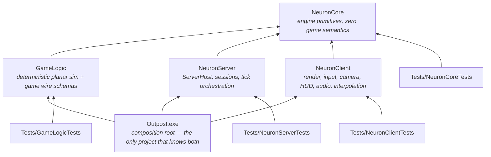

# Dependency Map & Public Interfaces

**Status:** Session output 2026-08-17 · **revised 2026-08-18 after S9.** Refines the fixed
dependency rules from the brief. Header-level contracts only — signatures live in code.
Namespaces: **`Neuron`** for the three engine libraries and **`Game`** for GameLogic
([AGENTS.md](../AGENTS.md) §1 F9). File names are flat per ADR-013 (no code subdirectories);
the tables below are also the **file-name registry** that keeps names unique repo-wide.

**The tables are a plan as much as an inventory.** A file marked *(planned)* has a slice and a
charter and no code yet; everything unmarked is in the tree. The distinction matters because
the registry's job is to reserve a name *before* the file exists (ADR-013 §4), so a planned row
is doing real work rather than describing something that is missing.

## The graph

Rules (hard): GameLogic depends **only** on NeuronCore. GameLogic never references
NeuronServer/NeuronClient. Nothing depends on the executable. Client and server never depend on
each other. **The engine libraries never reference GameLogic** — `Outpost.exe` is the only
project that knows both, and the seam is dependency inversion (ADR-014). The brief permitted
`NeuronClient`/`NeuronServer` to depend on GameLogic; that permission is deliberately declined,
because `Neuron*` is a shared engine serving a second game in the sibling repository.

## Rulings made this session (refinements, not bends)

1. **Game wire schemas live in GameLogic** (`Snapshot.h`, `OrderMessages.h`), not NeuronCore.
   Snapshot and order payloads *are* game semantics; NeuronCore's charter forbids them.
   NeuronCore owns only the semantics-free layer: byte IO, JSON, framing, handshake/ping
   messages, transport. *(ADR-004.)*
2. ~~NeuronClient links GameLogic from day one.~~ **Overturned by ADR-014.** The client needs
   GameLogic *code* (BounceParity's `ValidateOrder`, the footprint's `SolveFormation`) but not
   a GameLogic *dependency*: it declares `Neuron::WorldView`, and `Outpost.exe` implements it
   by forwarding to GameLogic's pure functions. Same function, same reason codes, same bounce —
   reached through an interface rather than a link-time symbol. *(The vtable sits in the
   executable rather than in GameLogic because `WorldView.h` is NeuronClient's; ADR-014 §2a
   records why that is the right side of the trade.)*
3. **The client never constructs an authoritative `World`.** It applies snapshots to a
   `ReplicatedView` (GameLogic type, quantised fields). When prediction arrives it will run a
   *separate* GameLogic world instance — never a reference to the server's. *(ADR-007 §5.)*
4. **NeuronCore's "zero game semantics" test:** every NeuronCore header must be plausible in
   an unrelated networked sim. A header mentioning ships, orders, formations, or hull classes
   is in the wrong library — flag it in review, no exceptions without a session decision.
5. **DirectXMath is toolchain, not a dependency.** It is header-only, OS-free SDK math, so
   **GameLogic includes it directly** without violating "GameLogic depends only on NeuronCore"
   (a rule about *our* libraries). There is no NeuronCore math header at all. *(ADR-010.)*
6. **The JSON parser is NeuronCore's**, and GameLogic uses it for universe content — in
   charter, since NeuronCore is GameLogic's permitted dependency. File *reading* stays in the
   hosts; GameLogic parses bytes. *(ADR-012.)*
7. **Surfaced, needs owner sign-off:** if the Schannel-flavour msquic package ever has to swap
   to the OpenSSL flavour (older-Windows support, cert-file loading), that is treated as
   *within* the existing "msquic via NuGet" approval — flagged here so the assumption is
   visible. *(ADR-003, Risk R3.)*

## Per-project contracts

### NeuronCore — engine primitives (static lib)
Allowed deps: Windows SDK (Win32, Winsock2, **DirectXMath**), msquic (NuGet), C++ standard
library. C++/WinRT only where genuinely useful (none identified in MVP).
**No math header** — DirectXMath is used natively at call sites (ADR-010).

| Area | Files | Notes |
|---|---|---|
| Foundation | `Debug.h` (asserts) `Log.h` `Clock.h` (QPC + `WaitableTimer`) `Hash.h` (FNV-1a) `Random.h` (PCG32) `OwnerThread.h` (`Claim`/`Release`/`NEURON_ASSERT_OWNER`) | Named to avoid shadowing `<assert.h>`/`<time.h>` (ADR-013 §3a); no game types anywhere below. `OwnerThread` is here rather than in GameLogic because a thread id is an OS concept and GameLogic is OS-free — what the game embeds is the object, never the id. Debug-only, and never simulation state: an owner id that reached the world hash would make a replay depend on which thread ran it (ADR-007 §7) |
| Memory/containers | `Arena.h` `RingBuffer.h` (`RingBuffer` SPSC + `MpscRingBuffer`) | std containers allowed; arenas for frame/tick scratch. Both bounded and allocation-free: a full queue drops and counts rather than stalling the thread that pushed |
| Tasking | `TaskPool.h` (`Submit`, `WaitGroup`, `Wait`) | Boot bakes only in MVP (ADR-007 §4). Mutex + condvar + `std::function` on purpose: a lock-free queue here would be fixed-capacity and would have to drop work, which for a mesh load is a bug rather than a trade |
| Telemetry | `Telemetry.h` (`NEURON_COUNTER`, `NEURON_SPAN`, lane registry, `TelemetrySnapshot`) | Per-lane SPSC rings drained by one collector; cap 16; a lane is a role, not a thread, so re-registering a name adopts it. Compiled into Release — `tickOverrun` ships (ADR-002) |
| Serialization | `ByteReader.h` `ByteWriter.h` `EntityRecord.h` `OrderIntent.h` | Bounds-checked, little-endian; `EntityRecord` is the neutral 20-byte replication record the engine speaks instead of a game type (ADR-014 §3); its spare third byte was renamed `flags` → `groupId` in S11b so a ship's wing could ride across as a number the engine carries and does not read. `OrderIntent.h` carries the command half of both seams — `OrderIntent`/`OrderVerdict`/`OrderPreview`, plus S9's `OrderDefaults` (which command the puck makes), S10's `OrderOption` (which parameters that command accepts, and what to call them), S11d's `OrderKindOption` (which commands *exist*, what they are called, and which this build has content for) and `OrderProgress`/`OrderFeedback` (what the authority is still working on). S11c gave `OrderPreview` the ghost's two label numbers — `etaSeconds` and a fixed `label` buffer — because the engine can compute the kilometres from two points it holds but not the seconds (that needs a movement model) and not the words (`MOVE` is a kind and `CLAW` a formation). The label is a buffer rather than a `const char*`, unlike `OrderOption::name`, because a ghost *keeps* its preview for as long as the order is in flight and a pointer into the world view would by then describe whatever was previewed next. Here rather than beside either seam because `WorldView::PreCheck` and `Simulation::ApplyOrderBytes` must return the same verdict type and NeuronClient cannot see NeuronServer (ADR-014 §2b) |
| JSON | `Json.h` (flat-node DOM, iterative parse, `int64`-exact numbers, diagnostics) `JsonWriter.h` (strict output) | Config + universe + sound banks (ADR-012 §C) |
| Transport | `Transport.h` (`Transport`, `Connection`, `Listener`, `Stats`) `QuicTransport.h` | QUIC-shaped contract, `Poll()` delivery, 1,152 B datagram cap (ADR-003); msquic only since S13 — `UdpTransport.h` deleted by owner directive |
| Wire (semantics-free) | `Wire.h` (framing, `Hello/Welcome/UpdateRequired/Refuse/Ping/Pong/Goodbye`) | Schema-hash mechanism lives here; game payloads do not |

### GameLogic — deterministic sim (static lib)
Allowed deps: **NeuronCore only**, plus DirectXMath as toolchain (ruling 5). No Windows
headers, no rendering, no sockets, no clock, no file IO.

| Area | Files | Notes |
|---|---|---|
| Identity | `Ids.h` (`ShipId`, `WingId`, `OrderId`, `SystemId`, `CelestialId`, `StationId`, `GateId`) `ShipClass.h` | 11-value closed taxonomy; Fighter/Cruiser reserved ids (ADR-009 §6) |
| Universe | `Ids.h` (`RegionId`/`SystemId`/`CelestialId`/`StationId`/`GateId`, all `u16`, authored not assigned) `Universe.h` (`UniversePos{i64,i64}`, `UniverseDef`, region/constellation/system/celestial/station/gate/**anchor** tables, `GridAnchor`, `LocalFromUniverse`/`UniverseFromLocal`) `UniverseParse.h` (JSON bytes → `UniverseDef`, pure) `UniverseGen.h` (the bake — pure, **integer-only**, one seeded PCG32: regions, constellations, systems, the gate graph, celestials at real orbital scales, stations, and the **anchor table** ADR-016 §3 makes the only warp destinations; plus the JSON that expresses it) | Exact integer metres — **no float anywhere in the model**, which is what makes the hash and the reconstruction exact; `universeHash` over canonical parsed content, walked in id order so reordering a file is not a content change (ADR-012 §D) |
| World | `World.h` (SoA tables, `ShipId`↔slot indirection, seeded `Pcg32`, the `OrderGroup` table, `Tick` = IngestOrders → GroupAdvance → Steering → Integrate → Separate) `ShipClass.h` (the closed eleven, compiled in — movement envelope, contact radii per ADR-015, and the cosmetic hover/bank constants per S14) `WorldHash.h` (FNV over raw state bits) | Single-writer; state stored as `XMFLOAT2` (ADR-010 §3); guidance carries a resolved target rather than ADR-005 §1's `groupRef` so Steering never learns groups exist; Steering also brakes for and deflects around traffic and `Separate` projects residual overlap after Integrate (ADR-015 — positions move, velocities never, stations are terrain); the hash folds float *bits* because same-binary replay means bit-identical, and folds the group table so a queued plan is part of world state |
| Station | `Station.h` (`RosterEntry`, `RosterView`, `StationVerb`, `StationCommand`, `ValidateStationCommand`, `UNDOCK_PROTECTION_SECONDS`) | Docked ships are rows, not hulls (ADR-017 §1) — `(ShipId, class, wing)` at the universe layer, which buys clutter prevention by construction, leaves the grid-teardown rule untouched, and costs no snapshot bytes and no tick time. **No gauges, and that *is* the repair rule:** undocking spawns a ship full because the roster had nothing to damage. Undocking is not an order on world ships — there are none to name — so it is a *station command*, validated by one pure function over the replicated roster both halves hold, sharing the order stream's sequence, ack and reason enum. No `World` in this header, deliberately: that is what makes the client able to call it. Wings are emergent (§6) — a wing exists iff a ship carries its number, so there is no wing table to desync and disbanding is reassigning the last member |
| Event record | `EventRecord.h` (`EventKind`, `EventEntry`, `EventRecord::Emit`) | One append-only, per-commander stream at the universe layer (ADR-018 D19), built with one consumer because four surfaces are already designed on it — the toast backlog and its UNREAD count, REVIEW LOSSES, the reconnect away-log and the strategic feed — and four consumers of four producers would be four bugs about the same ten events. **Not hashed, deliberately:** an event describes something the simulation already did, so folding the description in would make a replay depend on how talkative the build was. Three numbers and no text: a string here could not be translated, the client already knows how to name a station, and `count` is what makes "eight ships docked at Vesta-3" one line instead of eight. Capped at 512 with the drop **counted**, because "your log starts here because it was full" is a different statement from "nothing happened before this" |
| Universe runtime | `WorldRegistry.h` (`RosterEntry`, `RegistryConfig`, `Borrow`/`Peek`/`Tick`/`Spawn`/`Despawn`/`AddViewer`/`RemoveViewer`/`HostForAnchor`/`AllocateShipId`/`LocationOf`/`Roster`/`Hash`/`HandOff`) `Transfer.h` (`HostId`, `TransferId`, `TransferKind`, `TransferMember`, `TransferRequest`, `TransferRecord`, `WARP_BASE_SECONDS`) | The many-grids layer a session actually runs: which anchors are live, what is on each, where any ship is, and the one shard tick they all advance on (ADR-016 §4, U2). Shaped by [ADR-019](ADR/ADR-019-shard-topology.md) even though it runs in one process — worlds are addressed by `AnchorId` and never by a pointer held across a tick, `HostForAnchor` exists and returns zero, and player-scoped questions go through `LocationOf` rather than a walk; at `HostId = 0` that costs a type and a function returning a constant. It is the one file outside the universe area that may read a `UniverseDef` — it looks an anchor up and never does math on a position, which is why the CI determinism guard excludes it from the *content* rule and not the *coordinate* one. Authored occupants get the ids the bake derived from their anchor (ADR-018 D6a), which is what makes teardown and recreate reproduce a world exactly; dynamic ids come out of a separate block. **Worlds forget** — nothing is saved on the way out, and a ship-less world held alive only by a viewer is outside the hash (ADR-018 D8), or where a camera pointed would be a simulation input. T1 added the other half of that rule: the **station rosters and the transfer bus** are universe-layer state that outlives the grids, so a station grid tears down with a full roster and the roster is untouched. Transfers apply **between** ticks in `(applyTick, transferId)` order (ADR-018 D17) — filed by a world during its tick, stamped by the registry because the counter is the host's and a world minting its own would give two grids one number, applied before any world runs again. Rosters and the in-flight bus fold into `Hash`: a replay is the order logs *plus* the transfer log. `Spawn`/`Despawn` exist beside `Borrow` because the ship→location index is the registry's to keep, and a ship placed through a borrowed world would be missing from it |
| Orders | `Orders.h` (`OrderKind`, `QueueMode`, `FormationId`, `OrderReason` + its text, `OrderLeg`, `OrderSubmit`, `OrderState`, and the names for a kind, a formation and a kind's parameter) `Validate.h` (`ValidationView`, `ValidateOrder`) `Eta.h` (`TravelSeconds`, `RemainingSeconds`, `GroupTravelSeconds`) | Three files because they are three decisions and only the first needs a world (`Orders.h` is data, `Validate.h` decides, `OrderMessages.h` encodes). A leg is wire-quantised — centimetres and turns/65536 — because validation consumes quantised values only (ADR-005 §4), and a struct storing metres would make the mistake available. `Eta.h` is a *function of the class table* rather than a method on `World`, because two callers need it and only one of them has a world: the client's pre-check answers the ghost's label before the order is sent, and S12's authority answers it again per leg. Measured against the simulation it predicts: 0.4 % on a straight run, and always optimistic. S12 added the moving-start form and the authority replicates it per leg — a rest-to-rest estimate of a *remaining* journey charges a ramp the ships already paid and peaks at 44.8 % error as they arrive, against 2.4 % for this one. **The order of the checks is part of the contract:** an order failing two rules must fail the same one on both machines, or the player reads a different explanation depending on which answered |
| Formations | `Formation.h` (`FormationId{Line,Wedge,Claw}`, `FORMATION_IDS`, `FormationName`, `SolveFormation`, `FormationExtentMetres`) | Pure, and the client's footprint preview calls this exact function through the seam. Assignment is by **ascending `ShipId`**: the client's selection and the server's dense table hold the same ships in different orders, and a solve that followed array order would put the preview one station out from where the fleet goes. All three shapes are solved as of S10, and two properties hold across them — each puts something exactly on the anchor, and adjacent stations are exactly one spacing apart. That spacing bought the MVP its "no inter-ship avoidance" (ADR-005 §2, spent by ADR-015); it now guarantees the finer claim that parked neighbours are never in contact — spacing ≥ 4·contact radius, table-tested — so a formation in flight never fights its own contact model |
| Wire (station) | `StationMessages.h` (`StationCommand` ↔ bytes, `StationRoster` ↔ bytes) | `StationCommand` rides the reliable acked order stream, sharing its sequence, its `OrderAck` and its reason enum — one feedback loop for "I told the authority to do something", not two. `StationRoster` is the first resident of ADR-016 §6's summary family (~1 Hz), sent **per viewer**: ADR-017 §1's privacy rule is a wire fact from the first message, and on a broadcast-shaped sender it would be a silent leak nothing catches. **Ship ids are u32 here** (ADR-018 A11/D6) while the sim's stay u16 — a roster is what a reconnect screen reads and what a save file would hold, so the field that has to widen later is a schema break later. An id past this build's range narrows to `INVALID_SHIP_ID` rather than truncating, because a truncating cast would validate a command against the wrong hull |
| Wire | `Snapshot.h` (full quantised snapshots over `Neuron::EntityRecord`, plus a reserved area of `OrderStateRecord`s and a `lastOrderSeqProcessed` high-water mark) `ReplicatedView.h` (client's quantised shadow + interpolation, and the newest snapshot's order records) `SchemaHash.h` `OrderMessages.h` (`OrderSubmit` ↔ bytes; the boundary a hostile payload stops at) | Full snapshots, no deltas, so loss is not a case to handle. The ship record is NeuronCore's `EntityRecord` rather than a `ShipRecord` of ours — ADR-004 §6 specifies exactly those twenty bytes and two matching layouts would eventually diverge. The schema string covers the **quantisation constants**, not just the fields. The order area is *reserved* rather than taking whatever is left, so the ship cap is a constant and not a function of how busy the player has been; orders are also the half that may truncate, because a missing ship reads as a despawn and a missing order costs one frame of ETA |
| Test hooks | `WorldHash.h` (FNV over state) | Replay determinism harness |

### NeuronServer — hosting the authority (static lib)
Allowed deps: **NeuronCore only** (ADR-014). It hosts *a* simulation, not *this* one.

| Area | Files | Notes |
|---|---|---|
| Seam | `Simulation.h` (`AdvanceTick`, `ApplyOrderBytes`, `WriteSnapshot`, `SchemaHash`, `ContentHash`) | Engine-declared, GameLogic-implemented, exe-injected (ADR-014 §2) |
| Host | `ServerHost.h` (`Start/Stop/Join`, takes a `Simulation&`) `ServerConfig.h` (plain struct, assembled by the exe) | The future OutpostServer.exe API, verbatim (ADR-008) |
| Sessions | *(planned)* `Session.h` (per-connection state, handshake, order seq/ack bookkeeping) | Session *table*; empty server keeps ticking. Still a struct inside `ServerHost.cpp` — it earns a file when a second thing needs it |
| Replication | *(planned)* `SnapshotSender.h` (emit → datagram per client) | Per-client path; interest/delta land here later. Today `ServerHost` serialises once and fans the same bytes out, which is correct while every client sees the whole world |

### NeuronClient — the player's machine (static lib)
Allowed deps: **NeuronCore only**, plus the Windows SDK (D3D12, DXGI, DirectXMath, DirectWrite
for the atlas bake, **XAudio2 + X3DAudio**). No GameLogic (ADR-014).

| Area | Files | Notes |
|---|---|---|
| Seam | `WorldView.h` (`ApplySnapshot`, `BuildScene`, `PreCheck`, `SolvePreview`, `EncodeOrder`, `DefaultOrder`, `OrderOptions`, `OrderKinds`, `PollOrderFeedback`, `BuildRoster`, `ReasonText`, `SchemaHash`, `ContentHash`) + `NullWorldView`; the neutral types it speaks are `RenderScene` and `RosterRow` (here) and `OrderIntent`/`OrderVerdict`/`OrderPreview`/`OrderDefaults`/`OrderOption`/`OrderFeedback` (NeuronCore) | Engine-declared, exe-implemented, exe-injected (ADR-014 §2a); BounceParity runs the same function through it (§3). `FormationPreview` was renamed `OrderPreview` — the engine may name no formation (§2b). The last three arrived with S9's client half and each replaces a guess: which command the puck makes, what the authority is still working on, and what a reason code is called. `BuildRoster` is S11b's, and replaces the largest guess of the lot: the engine could group the replicated ships by `groupId` itself, and doing so would have decided in the engine that groups are named, that gauges average, and that an emptied group vanishes. `OrderKinds` is S11d's and stops the command row spelling `MOVE` and `ATTACK` in a two-game engine — a mistake no CI rule catches, because a string is not an include (ADR-014 §2c) |
| App | `ClientApp.h` (`Run`, takes a `WorldView&`) `ClientConfig.h` (plain struct) `Window.h` `ClearColour.h` | Frame loop on Main thread (ADR-007); `ClearColour` is deliberately free of D3D and C++/WinRT headers so presentation maths is testable without a device |
| Net/state | `ClientConnection.h` (handshake, ping, snapshot receipt, `SendOrder` on the reliable control channel, `OrderAck` drained as `OrderVerdict`) `SnapshotBuffer.h` (slew-limited server-time estimate, render tick, staleness, drift) | The buffer owns the *clock*, not the payloads: it turns snapshot arrivals into a smooth render tick and the game answers what the world looks like at that instant. The estimate slews rather than tracking arrivals, because following jitter directly puts it straight on screen. Device-free, so the timing hardest to eyeball is the part most tested |
| Extract | `RenderWorld.h` (`InstanceRecord`, `SceneEntity`, `RenderScene`) `OverlayMark.h` (selection rings, gauge bars, order footprints and station ticks, in one 32-byte instanced stream) `OrderGhost.h` (PENDING → UNDER WAY → REJECTED, and the 150 ms bounce) | The future Game/Render thread seam. `InstanceRecord` is 24 bytes (S14 appended the cosmetic bank) *and is the per-instance vertex stream*, so its size is a static assert rather than a comment; `OverlayMark` is 32 for the same reason. A frame carries one `SceneEntity` per ship rather than three parallel arrays, so a ring is drawn exactly where a pick would have landed by construction rather than by two pieces of code being kept in step |
| GPU | `GpuCom.h` (`GpuPtr` = `winrt::com_ptr`) `GpuDevice.h` `GpuSwapChain.h` (+ the depth buffer and, since S14, the 4× MSAA colour target — the resources whose size is the swapchain's size) `GpuUploadRing.h` `GpuMeshes.h` (VB/IB per class) `GpuPasses.h` (Clear/Opaque/Nebula/OverlayWorld/Ui — all five built as of S11a) `GpuPipelines.h` | Fixed pass list w/ reserved slots (ADR-006); COM ownership is `winrt::com_ptr` throughout, created via `IID_PPV_ARGS(x.put())` (AGENTS.md §5) |
| Assets | `ObjMesh.h` (loader → submesh ranges) `GlyphAtlas.h` (DWrite bake) | Boot-time, TaskPool. Both parsers are free of D3D and C++/WinRT headers so `NeuronClientTests` can drive them with no device |
| Camera/input | `IsoCamera.h` (ortho 30°, yaw snap, zoom, `PlaneMappingForNdc`) `Picking.h` (`PixelsToNdc` → `NdcToPlane` → circle and box tests, plus the inverse `PlaneToNdc`) `Selection.h` (click, shift-click, box drag, `Retain`) `OrderPuck.h` (the right-drag: press names the place, the drag names the arrival facing) `InputMap.h` (`InputFrame` → `CameraIntent`; `Window` owns the virtual-key table, and `CycleParameter` is a key standing in for S11's command wheel) | Client-only state, and **no ray**: the projection is orthographic and the world is a plane, so a pixel maps to a plane point through `PlaneMapping` and picking is a distance test against circles. That is what ADR-006 §2 bought by fixing the camera as ortho, and it is why all of this is a unit test rather than a screenshot. The one conversion lives in `Picking.h` so box-select, point-pick and the puck cannot drift apart (ADR-006 §11's "one code path") |
| Hud | `UiDrawList.h` (screen-space quads and text runs, pooled) `UiLayout.h` (the print's zones from a viewport and a scale) `ToastStack.h` (`alerts-and-toasts.png`'s five priorities, dwell, coalescing and cap) `HudRoster.h` (one roster row: a name and four numbers, and never the word for what a row *is*) `HudPalette.h` (the HUD's colour table, resolved once from `client.ui.palette`; the colour-vision palettes will be more names for the same struct) `GhostLane.h` (ADR-006 §8's draw list *(B)*: the ghost's dashed lane — a polyline through the queue's waypoints since S12 — clipped and dashed on the CPU, with a per-leg ETA and the plan's own label lines) `CommandRow.h` (the print's bottom row, laid out *and* hit-tested in one file so the button you press is the button you see) `DebugStrip.h` (S14: the Tier-1 counters strip — a rolling history over the drained telemetry lanes and a builder that emits into `UiDrawList`, both device-free; the client is the collector ADR-007 §8 promised) | Prints are the spec. Text stays text until the pass expands it against the atlas, so everything that decides what the HUD *says* is device-free. The order puck and the ghost are **not** here — they turned out to be input and extract respectively; what S9 did leave was the bounce toast, and S11a raises it |
| Nebula | `NebulaField.h` (periodic value-noise tile, device-free) `GpuNebula.h` (bake + upload + SRV) | ADR-006 §1a's built node; the field is CPU-baked so its maths is testable without a device, and periodic so the tile wraps at any zoom |
| Audio | *(planned, S15)* `AudioSystem.h` (XAudio2 graph, voice pool) `AudioListener.h` (focus/zoom listener model) `AudioBank.h` (JSON bank + RIFF WAV) | 5 submixes; `AudioUpdate` stage after Extract (ADR-011) |

### Outpost.exe — composition root
Allowed deps: NeuronServer, NeuronClient, GameLogic (and transitively the rest). Files:
`Main.cpp` (`wWinMain`, **arguments ignored**, and the `Neuron::Simulation` implementation),
`ConfigLoad.h/.cpp` (locate + parse + merge `Outpost.json` and the user layer, and
`ResolveContentPath`, the one rule for finding authored content), `AppConfig.h/.cpp`
(JSON → `ServerConfig`/`ClientConfig` structs), `UniverseBake.h/.cpp` (the `"mode": "bake"` host mode -- runs the generator, round-trips its
output before trusting it, and writes the committed universe), `UniverseLoad.h/.cpp` (locate + read the
universe definition, then hand the bytes to GameLogic's pure parser — file IO stays here so
GameLogic stays OS-free, ADR-009 §7), `ReplicatedWorldView.h/.cpp` (the `Neuron::WorldView`
implementation), boot/shutdown ordering (ADR-008), `SelfTest.h/.cpp` (the `selfTest` driver:
server up, handshake, heartbeat, exit code), `TickSoak.h/.cpp` (R10's tick-budget soak, run by
the self test so the number is re-taken in Release on every push — ADR-018 A4/D1c),
`ShaderTable.h/.cpp` (the compiled shaders, from
`Outpost/Shaders` via `dxc` (SM 6.7, both configs — ADR-018 D12) into
`Outpost/CompiledShaders` — the engine builds pipeline states
and the game says which shaders go in them, ADR-013 §1a). **Nothing else.** Nothing depends on
it.

It is also the only place universe metres become render metres: it reads the authored
placements, converts them into the tactical grid's local frame, and hands them to the world
view. GameLogic owns the exact coordinates and the engine owns the drawing; the conversion
belongs to the one thing that knows both (ADR-014). Since S14 `SelfTest` is the aggregated CI
gate: schema self-check, wire round-trips, a replay-determinism run, then the whole
handshake + order + snapshot loop over the QUIC loopback, all behind one exit code on a
GPU-less runner.

**And it is where the engine's interfaces are implemented** (ADR-014 §2a).
`ReplicatedWorldView.h/.cpp` is a `Neuron::WorldView`; the `Simulation` in `Main.cpp` is the
server's half. Both forward to GameLogic rather than containing logic. They are here rather
than in GameLogic because `WorldView.h` is NeuronClient's and `Simulation.h` is NeuronServer's,
and putting either project on GameLogic's include path would trade a structural guarantee —
GameLogic is free of Windows, D3D12 and file IO, so its tests need no device — for a convention.

*(`ParkedFleetView` was the S5c placeholder that stood here and invented a fleet because there
was nothing to replicate yet. S7 deleted it; the client now draws snapshots, so nothing on
screen is local fiction.)*

The one place a forward is more than a forward is `MakeSubmit` in `ReplicatedWorldView.cpp`,
and it is worth naming: `PreCheck`, `SolvePreview` and `EncodeOrder` all quantise the player's
click through **that one function**, because ADR-005 §4's parity rule is precisely that the
numbers validated are the numbers sent. Two conversions would be two roundings, and the client
would pass an order the server then refused with no way to explain it.

### Tests/* — VS CppUnitTestFramework (added on main, 2026-08-17)
Each test project depends on its library under test plus that library's allowed deps.
- `GameLogicTests` — replay determinism (double-run hash equality), wire round-trip/underrun,
  formation geometry, validation parity (quantised inputs), universe JSON parse round-trip +
  rejection, `universeHash` stability, anchor+local reconstruction. **Live from S5b**: the
  universe suite runs on text held in the test file, so it needs no filesystem and no fixtures
  — the practical payoff of keeping file IO out of GameLogic.
- `NeuronCoreTests` — byte IO, ring buffers, **JSON conformance corpus** (valid/invalid,
  `int64` exactness past 2⁵³, depth cap, duplicate keys, escapes/surrogates, writer
  round-trip), UDP loopback handshake (real socket), `Welcome` round-trip over a full-width
  negative anchor — a field narrowed anywhere in the chain folds there rather than in a
  session where the world quietly renders somewhere else.
- `NeuronServerTests` — `ServerHost` start/stop/join, session handshake against a raw
  core-level client, the simulation's `WorldMeta` arriving intact in `Welcome`, config structs
  built in code (no files).
- `NeuronClientTests` — interpolation/extrapolation timeline, picking and selection gestures,
  OBJ parser, camera projection and input mapping, the NDC→plane mapping round-tripped against
  the real view-projection, the nebula field's determinism/sparseness/seamless wrap, extract
  layout, overlay marks, the order puck's plane-space facing, the ghost lifecycle and its
  bounce, and **a `WorldView` written from engine headers alone and driven through every
  method** (S5c's proof that the seam carries no game shape — extended by S9's three new
  calls). Audio listener/emitter math and sound-bank parsing arrive with S15. **No D3D device
  and no audio device in unit tests**; GPU/audio smoke lives in `selfTest`-adjacent manual
  slices.

> Resolved (S5): the test .vcxprojs now carry `ProjectReference`s and matching include paths.
> The observation that they did not is kept here only because it is why the client's
> device-free headers are device-free.

## Include discipline (ADR-013)

- **Flat project folders**, no code subdirectories; IDE grouping via `.vcxproj.filters`.
- **File names are unique repo-wide** — the tables above are the registry; check before adding.
- **Each project lists the libraries it uses as `$(SolutionDir)<Project>` include paths**
  (owner decision, already configured), so includes are unqualified: `#include "Json.h"`
  reaches NeuronCore from anywhere entitled to it. Uniqueness is what keeps this unambiguous,
  which makes the registry above load-bearing rather than advisory: a duplicate file name
  silently resolves to whichever path comes first.
- The include path is *not* the dependency rule. NeuronClient can see NeuronCore's headers
  because it lists them; it must not list GameLogic (ADR-014).
- A project's non-exported headers are simply those no other project includes; there is no
  `Public/` folder split (dropped by ADR-013).
