# Dependency Map & Public Interfaces

**Status:** Session output 2026-08-17 · refines the fixed dependency rules from the brief.
Header-level contracts only — signatures live in code. Namespaces: `neuron::core`,
`neuron::server`, `neuron::client`, `game`.

## The graph

```mermaid
flowchart BT
    NC["NeuronCore<br/><i>engine primitives, zero game semantics</i>"]
    GL["GameLogic<br/><i>deterministic planar sim + game wire schemas</i>"] --> NC
    NS["NeuronServer<br/><i>ServerHost, sessions, tick orchestration</i>"] --> NC
    NS --> GL
    NCL["NeuronClient<br/><i>render, input, camera, HUD, interpolation</i>"] --> NC
    NCL --> GL
    EXE["Outpost.exe<br/><i>composition root</i>"] --> NS
    EXE --> NCL
    TGL["Tests/GameLogicTests"] --> GL
    TNC["Tests/NeuronCoreTests"] --> NC
    TNS["Tests/NeuronServerTests"] --> NS
    TNCL["Tests/NeuronClientTests"] --> NCL
```

Rules (hard, from the brief, unchanged): GameLogic depends **only** on NeuronCore. GameLogic
never references NeuronServer/NeuronClient. Nothing depends on the executable. Client and
server never depend on each other.

## Rulings made this session (refinements, not bends)

1. **Game wire schemas live in GameLogic** (`game/wire/`), not NeuronCore. Snapshot and order
   payloads *are* game semantics; NeuronCore's charter forbids them. NeuronCore owns only the
   semantics-free layer: byte IO, framing, handshake/ping messages, transport. *(ADR-004.)*
2. **NeuronClient links GameLogic from day one** — not "later for prediction". Load-bearing
   uses now: shared `ValidateOrder` + reason codes (BounceParity), shared `SolveFormation`
   (real footprint preview), wire schemas, class table. The brief's "may depend" is exercised
   deliberately; any client use of GameLogic beyond these pure/read-only surfaces (e.g.
   mutating a world) is out of contract.
3. **The client never constructs an authoritative `World`.** It applies snapshots to a
   `ReplicatedView` (GameLogic type, quantised fields). When prediction arrives it will run a
   *separate* GameLogic world instance — never a reference to the server's. *(ADR-007 §5.)*
4. **NeuronCore's "zero game semantics" test:** every NeuronCore header must be plausible in
   an unrelated networked sim. A header mentioning ships, orders, formations, or hull classes
   is in the wrong library — flag it in review, no exceptions without a session decision.
5. **Surfaced, needs owner sign-off:** if the Schannel-flavour msquic package ever has to swap
   to the OpenSSL flavour (older-Windows support, cert-file loading), that is treated as
   *within* the existing "msquic via NuGet" approval — flagged here so the assumption is
   visible. *(ADR-003, Risk R3.)*

## Per-project contracts

### NeuronCore — engine primitives (static lib)
Allowed deps: Windows SDK (Win32, Winsock2), msquic (NuGet), C++ standard library. C++/WinRT
only where genuinely useful (none identified in MVP).

Public surface (headers, indicative):
| Area | Headers | Notes |
|---|---|---|
| Foundation | `Assert.h` `Log.h` `Time.h` `Hash.h` (FNV-1a) `Random.h` (PCG32) | QPC wrappers; no game types anywhere below |
| Math | `Math.h` (`float2/3/4`, `mat4`, ortho/look, plane-ray) | Right-handed, +Y up render, radians |
| Memory/containers | `Arena.h` `RingBuffer.h` (SPSC/MPSC) | std containers allowed; arenas for frame/tick scratch |
| Tasking | `TaskPool.h` (`Submit`, `WaitGroup`) | Boot bakes only in MVP (ADR-007 §4) |
| Telemetry | `Telemetry.h` (`NEURON_COUNTER`, `NEURON_SPAN`, lane registry) | Per-lane SPSC rings, owner-drained (corpus `Telemetry.h`) |
| Serialization | `ByteReader.h` `ByteWriter.h` | Bounds-checked, little-endian |
| Transport | `Transport.h` (`ITransport`, `Connection`, `Listener`, `Stats`) `UdpTransport.h` `QuicTransport.h` | QUIC-shaped contract, `Poll()` delivery, 1,152 B datagram cap (ADR-003) |
| Wire (semantics-free) | `WireCore.h` (framing, `Hello/Welcome/UpdateRequired/Refuse/Ping/Pong/Goodbye`) | Schema-hash mechanism lives here; game payloads do not |

### GameLogic — deterministic sim (static lib)
Allowed deps: **NeuronCore only.** No Windows headers beyond what NeuronCore re-exports; no
rendering, no sockets, no clock.

| Area | Headers | Notes |
|---|---|---|
| Identity | `Ids.h` (`ShipId`, `WingId`, `OrderId`, `SystemId`, `CelestialId`, `StationId`, `GateId`) `ShipClass.h` (11-class closed set + movement params) | Icon-sheet taxonomy is the enum, `HullClass` order = wire order; Fighter/Cruiser are reserved ids (ADR-009 §6) |
| Universe | `Universe.h` (`UniversePos{i64,i64}`, `UniverseDef`, region/system/celestial/station/gate tables, `GridAnchor`) `UniverseParse.h` (bytes → `UniverseDef`, pure) | Exact integer metres; parsing is pure — file IO stays in hosts (ADR-009 §7) |
| World | `World.h` (authoritative tables + `Tick(orders[]) `) `ReplicatedView.h` (quantised client view + `ApplySnapshot`) | Single-writer; owner asserts in debug |
| Orders | `Orders.h` (`OrderSubmit`, `OrderGroup`, 4-leg queue) `Validate.h` (`ValidateOrder`, `ReasonCode`) | Validation consumes wire-quantised values only (ADR-005 §4) |
| Formations | `Formation.h` (`FormationId{Line,Wedge,Claw}`, `SolveFormation`) | Pure; client footprint preview calls this exact function |
| Wire | `wire/Snapshot.h` `wire/Order.h` `wire/SchemaHash.h` | Message structs + Read/Write + schema string (ADR-004) |
| Test hooks | `WorldHash.h` (FNV over state) | Replay determinism harness |

### NeuronServer — hosting the authority (static lib)
Allowed deps: NeuronCore, GameLogic.

| Area | Headers | Notes |
|---|---|---|
| Host | `ServerHost.h` (`ServerConfig`, `Start/Stop/Join`) | The future OutpostServer.exe API, verbatim (ADR-008) |
| Sessions | `Session.h` (per-connection state, handshake, order seq/ack bookkeeping) | Session *table*; empty server keeps ticking |
| Replication | `SnapshotSender.h` (emit → datagram per client) | Per-client path; interest/delta land here later |

### NeuronClient — the player's machine (static lib)
Allowed deps: NeuronCore, GameLogic, Windows SDK (D3D12, DXGI, DirectWrite for atlas bake,
XAudio2 later).

| Area | Headers | Notes |
|---|---|---|
| App | `ClientApp.h` (`ClientConfig`, `Run`) `Window.h` | Frame loop on Main thread (ADR-007) |
| Net/state | `Connection.h` (handshake, ping) `SnapshotBuffer.h` (ring, interp/extrap ≤250 ms, STALE) | Feeds Extract only |
| Extract | `RenderWorld.h` (`InstanceRecord`, overlay lists, HUD state) | The future Game/Render thread seam |
| GPU | `Device.h` `SwapChain.h` `UploadRing.h` `Passes.h` (Clear/Opaque/OverlayWorld/Ui) `PSOs.h` | Fixed pass list w/ reserved slots (ADR-006) |
| Assets | `ObjMesh.h` (loader → submesh ranges) `GlyphAtlas.h` (DWrite bake) | Boot-time, TaskPool |
| Camera/input | `IsoCamera.h` (ortho 30°, yaw snap, zoom) `Picking.h` (ray∩plane + 2D tests) `InputMap.h` | Client-only state |
| HUD | `Hud.h` (roster, context bar, ability rack stub, toasts) `OrderPuck.h` (drag/facing/ghost lifecycle) | Prints are the spec |

### Outpost.exe — composition root
Allowed deps: NeuronServer, NeuronClient (and transitively the rest). Contains `main`/
`wWinMain`, arg parsing, config assembly, boot/shutdown ordering (ADR-008), `--selftest`
driver. **Nothing else.** Nothing depends on it.

### Tests/* — VS CppUnitTestFramework (added on main, 2026-08-17)
Each test project depends on its library under test plus that library's allowed deps.
`GameLogicTests` carries the heavyweight suites: replay determinism (double-run hash
equality), wire round-trip/fuzz-underrun, formation geometry, validation parity (quantised
inputs), universe parse round-trip + rejection, `universeHash` stability, and anchor+local
position reconstruction. `NeuronCoreTests`: byte IO, ring buffers, UDP loopback handshake (real socket).
`NeuronServerTests`: ServerHost start/stop/join, session handshake against a raw core-level
client. `NeuronClientTests`: interpolation/extrapolation timeline, picking math, OBJ parser —
**no D3D device in unit tests**; GPU smoke lives in `Outpost.exe --selftest`-adjacent manual
slices.

> Repo observation: the freshly added test .vcxprojs contain **no ProjectReference yet** to
> the libraries they test (and will need `AdditionalIncludeDirectories` to match). Project
> files are owner-maintained per the brief — flagged here rather than edited.

## Include discipline

Cross-project includes are `<Project>/Public.h`-style rooted paths via
`$(SolutionDir)<Project>` (already configured on main): `#include "NeuronCore/Transport.h"`.
A project's private headers live beside its cpp files and are never included across project
boundaries; the tables above define what "public" means until a `Public/` folder split is
warranted.
